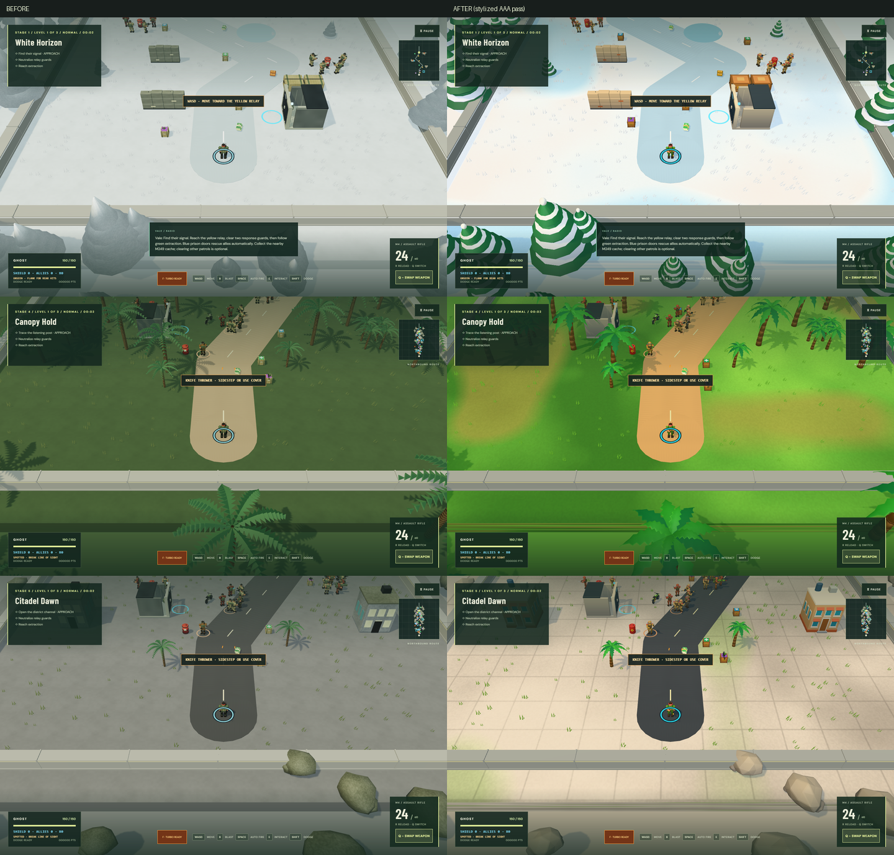
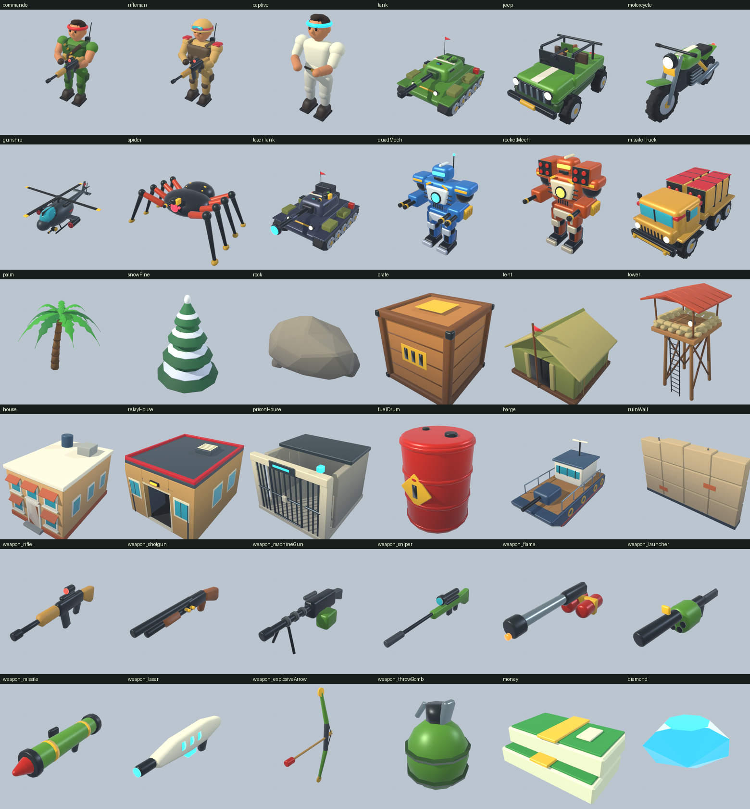

# RAMBO 3D — Operation Nightfall

**Play:** https://buicongnguyen.github.io/rambo_3D/

A three.js / Blender solo action game with seven stages, three levels per stage, eleven weapons, and playable motorcycles, jeeps and tanks. The first operation uses a compact 44 × 69 m map, with 12 soldiers and two relay guards on Normal. Start with a rifle and four arcing frag grenades; secure the relay and extract without needing to clear every patrol. Equipment and enemy density expand across the first three missions. Later stages begin with a 164 m zigzag approach, followed by a 202 m O loop with a choice of two arms or a 301 m U expedition, then a 372 m S or mirrored S finale (including 45-degree variants). Square maps measure 136 × 136 metres, or 196 × 196 metres for diagonal S routes. Small destructible trees divide the road arms; all routes remain tank-accessible. Approach the relay to secure it automatically, on foot or in a vehicle. Response guards walk out of nearby Blender-authored barracks in staggered waves. Clear the counterattack and follow the tactical map to extraction; eliminating every hostile on the map ends the mission on the spot. See [relay houses and automatic securing](docs/RELAY_HOUSES.md). Level three of each stage ends with command bosses: helicopters, climbing spiders, laser tanks, four-gun humanoids, rocket-and-gun humanoids or twin-launcher missile trucks. Existing bosses also have an independent light gun.

## Rescue squad and recovered treasure

Approach cyan prison doors to free soldiers automatically. Up to three allies follow you. They engage any enemy they can see within 18 m on their own and otherwise cover your line of fire, using their own ammunition. They wear cyan identification marks. They travel with your vehicle and return on later missions after extraction. Rescue stops are optional and allies are protected support, keeping the arcade mission simple.

The opening has an early M249 cache with 60 bonus rounds. Collect banknotes (10 credits), gold (25) and rescue diamonds (75). Each successful mission is graded with up to three stars: complete it, beat the route's par time, and finish above 50% health. Every star banks 10 bonus credits. The debrief itemises banknotes, gold and diamonds before banking, and each level keeps its best grade on the stage cards. The briefing quartermaster sells three permanent Field Kit ranks, each giving +10 starting shield and +1 frag per mission, for 100 / 200 / 300 credits. It also sells one-mission weapon supply drops: shotgun 40, M249 70, grenade launcher 90, anti-armor missile 120 and laser 180 credits. These are delivered at every deployment until a mission is won. Existing one-in-three enemy loot odds and difficulty-scaled special-ammo rewards remain unchanged. See the [rescue design, balance and verification plan](docs/RESCUE_SQUAD_PLAN.md).

## Campaign

| Stage          | Terrain and combat                                                               |
| -------------- | -------------------------------------------------------------------------------- |
| White Horizon  | Broad ice patches, sliding momentum and snow-covered pine trees                  |
| Cinderfall     | Erupting volcano: every 9 s, two falling rocks with 3 s warning rings hurt either side |
| Dune Lifeline  | Sand traps reduce movement to one quarter speed                                  |
| Canopy Hold    | Dense jungle with destructible trees and explosive fuel drums                    |
| Citadel Dawn   | Buildings, barricades, flanking streets and extra patrols                        |
| Faultline Zero | Periodic dust plumes and 1–2-second earthquake freezes for ground enemies        |
| Mire Crossing  | Muddy water holes gradually sink and slow the player; move out to recover        |

Choose a stage from the briefing selector, or continue your saved level. Changing stages starts at that stage's first level when you deploy; credits, Field Kit ranks and rescued allies carry over, while per-level upgrades restart. Re-selecting your current stage keeps your saved level. Each completed level offers an upgrade. Campaign progress saves between levels, not during combat. Old three-mission saves migrate to the expanded campaign start while keeping the best score.

| Difficulty | Base health | Soldiers | Bosses in each stage finale |
| ---------- | ----------: | -------: | --------------------------: |
| Easy       |         230 |       1× |                           1 |
| Normal     |         150 |       1× |                           1 |
| Hard       |         150 |       2× |                           2 |
| Crazy      |         150 |       4× |                           4 |

After the opening raid (12 soldiers) and second mission (24 soldiers plus one tank), then the first finale (64 soldiers plus two tanks), patrols contain four times the original infantry population: 96–128 soldiers per normal stage level, with 32 additional soldiers in city levels. Regular enemy tanks add 3–5 more targets. Hard doubles these populations and Crazy quadruples them (640 soldiers plus 20 tanks in the city finale). Infantry fire two-round spreads; regular tanks combine heavy rockets and a light gun. The tactical balance pass gives the rifle 28 damage and M249 10 damage at 30 rounds/s; rockets and laser retain their heavy-target role. Difficulty also scales relay reinforcements. Every finale boss must be destroyed before extraction opens. Command bosses expose weak points during their downtime, taking 1.5× damage while landed or resting, while their guns cool, while the laser vents or while launchers reload. Below half health they enrage and attack 30% faster; the boss bar glows gold when a weak point is exposed and red when enraged. If you fall after securing the relay, **RETRY FROM RELAY** restarts at the relay with your health, ammunition, treasure, rescued allies and cleared patrols restored, and the counterattack begins again.

## Controls

| Input              | Action                                 |
| ------------------ | -------------------------------------- |
| WASD / arrows      | Move or drive                          |
| Mouse + left click | Aim and fire                           |
| Hold Space         | Assisted aim and fire                  |
| Hold B / BLAST     | Aim and fire at a safe explosive store |
| Shift while moving | Dodge                                  |
| E                  | Interact, board or exit                |
| R                  | Reload                                 |
| Q / SWAP WEAPON    | Cycle collected weapons / tank cannon  |
| F / TURBO          | Fire two weapons together for 3s       |
| Escape             | Pause / resume                         |

Mobile has a Tank-style analog movement joystick (drag gently to walk, farther to run; release to stop), FIRE, SWAP WEAPON, RELOAD, DODGE, TURBO, BOARD/EXIT/USE and PAUSE buttons. Motorcycles use your own weapons. Jeeps (mounted shotgun) and tanks (1,680 armor, 16 explosive cannon shells) add their mounted gun to your collected weapons: Q / SWAP WEAPON cycles mounted gun → collected weapons → mounted gun. Boarding, picking up weapons or ammunition, and running dry always switch to the strongest weapon that still has ammunition, mounted or carried. Limited grenades are never auto-equipped while a gun has ammunition. Personal magazines/reserves and mounted ammunition remain separate across swaps and exits; shells cannot be reloaded, and an empty mounted gun falls back to a personal weapon. Relays and prison rescues activate automatically in vehicles too. Exit your vehicle to extract. Moving tanks and jeeps crush infantry, with the normal fall/fade and score; stationary contact and soldiers behind solid cover do not award kills. Armored enemies and bosses cannot be run over.

The motorcycle, jeep and tank appear in guarded roadside bays around 13%, 40% and 67% of the route. Sniper, rocket and laser caches also have nearby defenders drawn from the existing patrol quota. Small multi-hit trees replace rock and concrete barriers in both graphics modes; destroy them to open shortcuts. Buildings still block movement and gunfire. Long, indestructible concrete walls enclose all four map edges in every level. Tanks crush small trees at half movement speed until their hull clears the tree footprint, then recover normal speed; bikes and jeeps must shoot through or go around. Nearby BOARD / EXIT / objective hints appear for one second, while E and the mobile USE / EXIT button remain available. From the first finale onward, each deployment scatters nine purple weapon crates, six green medical crates and five blue shield crates along accessible roadsides. Walk or drive nearby to collect them. Green supplies heal the player and repair the occupied vehicle; full health/armor leaves supplies available. Blue crates add 40 personal shield points up to 80. Shields absorb personal damage before health and remain stored while vehicle armor takes hits. Shoot red fuel drums or marked EXPLOSIVE crates for outward fireballs, sparks, debris and chain explosions. Damage falls off over a 5.5-metre radius: nearby soldiers can be killed, and players and vehicle armor can be damaged. Walls and buildings block blast damage. Trees can be shot or blasted apart. Enemy helicopters fly and land to rearm behind cover; spiders climb across obstacles and pause to rest; laser tanks telegraph a locked 3.2-metre-wide beam. Gunships and spiders fire frequent light volleys, then a slower heavy salvo with three warned 3.4-metre blast zones. Leave the warning rings or use solid cover.

## Bullet Storm combat

Press **F** or tap **TURBO**, then hold FIRE: two different weapons shoot together for three seconds. Each consumes its own magazine and reload reserve. Weapon swapping pauses during the burst; collected pickups trigger automatic strongest-weapon selection afterward. Turbo has a 14-second cooldown. **Tuned Weapons** unlocks auxiliary guns on all vehicles and adds 0.4 seconds per rank (maximum five seconds); at rank three, vehicles can fire three guns. **Light Kit** shortens Turbo cooldown by 0.75 seconds per rank to a minimum of eight seconds. Exiting, boarding, defeat and restarting cleanly end a burst.

Bullet tracers are compact rounded rounds at half the previous length and width. Both sides use orange bodies, yellow tips and a small red tail, including on snow; player cores are brighter yellow and incoming rounds are deeper orange. Killing shots throw infantry along the bullet's direction, with stronger hits throwing farther; obstacles stop the fallen body. Small blood marks fade with the corpse. Rocket-killed enemy tanks separate into pieces of their Blender models that arc, fall and fade. Trees burst into green dust, leaves and wood fragments. All transient effects have fixed lifetimes and population caps.

See [environment interaction details and validation](docs/ENVIRONMENT_INTERACTIONS.md) for perimeter walls, explosive stores, timed hints and tank tree crushing.

See [the implementation and improvement plan](docs/BULLET_STORM.md) for scope, upgrade rules and suggested next additions.

## Game feel

Kills land with a brief hit-stop, blasts and heavy hits shake the camera, and floating damage numbers show the damage actually dealt: amber for rear hits, grey for armour deflections, gold for kills. The crosshair flashes on hits and kills. A red arc around your soldier points toward each damage source, and a pulse warns below 30% health. Chained kills call out DOUBLE KILL through ONE-MAN ARMY. Enemy tanks wear desert paint and rescued allies wear cyan bandanas, so neither is mistaken for your own. All sound is synthesized with Web Audio, with no audio files:
- **Weapons:** each weapon has its own small voice, and the tank cannon has a heavy one.
- **Other combatants:** enemy and ally gunfire is quieter, fades with distance and pans left or right.
- **Cues:** explosions have a layered thump and rumble. Treasure, supplies and rescues each have a chime, and warning beeps sound before rockfalls and boss salvos.
- **Stingers:** short cues of 2 seconds or less play on deploy, victory, defeat, every fourth chained kill and each boss kill.
- **Background music:** each stage has its own arrangement of one original heroic theme. It climbs, struggles, then resolves on a rising cadence, a brave soldier's march home.
  - White Horizon is a snare march with bells.
  - Cinderfall drives on taiko drums.
  - Dune Lifeline uses desert plucks and frame drums.
  - Canopy Hold has a jungle flute and bongos.
  - Citadel Dawn has a city backbeat.
  - Faultline Zero is built on heavy timpani.
  - Mire Crossing turns the theme to a triumphant major key.
  - The briefing plays the title arrangement, and finales switch to a faster, drum-heavy version when the command bosses arrive.
  - Each 16-bar theme (about 30–40 s) is rendered once, off the main thread, into one looping buffer, so music costs almost nothing per frame.

The pause settings have separate **Sound effects** and **Music** switches, and the briefing's SOUND button turns both on or off. Enable *Reduce camera motion* to turn off shake and animated banners. On portrait phones the camera pulls back so riflemen and rocket troops stay on screen.

A guide arrow circles your soldier and points to the next goal: yellow to the relay, orange to the nearest guard, red to a command boss, green to extraction. For the relay and extraction it follows the mission road, and the current objective shows the remaining distance. Radio messages, tactical hints, interaction prompts and the boss bar share one feed at the top of the screen, so nothing covers your soldier. The cyan identity ring is drawn on the ground under the avatar, widening around an occupied vehicle.



## Run and build

Use Node.js 22.18 or newer (tests use native TypeScript stripping):

```sh
npm ci
npm run dev
npm test
npm run build
npx playwright install chromium
npm run test:e2e
```

Production output is `dist`; `npm run preview` serves it. Low graphics limits resolution, shadows, decoration and effects. Terrain mechanics, enemies and controls stay the same. Browser tests using software rendering do not establish frame rates on physical phones or PCs.

## Blender

44 original GLB models and their editable `.blend` sources are committed. Five headless generators share the stylized kit in `art/style.py`: chunky toy-like forms, soft bevels, saturated paint and one tiny painted-light ramp per file. Regenerate with:

```powershell
$blender = ".tools/blender-4.5.3-windows-x64/blender.exe"
foreach ($script in "build_assets", "build_relay_house", "build_rescue_kit", "build_ruin_wall", "build_infantry_kit", "build_ui_icons") {
  & $blender --background --factory-startup --python-exit-code 1 --python "art/$script.py"
}
```

The authoring scripts are the reproducible source. Regeneration replaces manual gallery edits; work on a copy for hand-authored variants. Models use articulated rigid joints for procedural motion, rather than skinned or motion-captured animation. The model library is about 4.2 MB, with a checked 5.5 MB budget, per-model triangle budgets for instanced crowds and scenery, and named-material contracts for runtime liveries. `build_ui_icons.py` renders the debrief and quartermaster icons (stars, credits, treasure, upgrades and supply weapons) from the same kit and GLBs into `public/ui`. See [the stylized AAA art, look and feel pass](docs/AAA_ART_AND_FEEL.md).



## Publishing

SSH remote: `git@github.com:buicongnguyen/rambo_3D.git`. Pushing `main` runs unit tests, builds the game, runs browser tests and publishes to GitHub Pages. Relative asset URLs support `/rambo_3D/`. The repository and game are public.

See [campaign expansion plan and behavior](docs/CAMPAIGN_EXPANSION.md), [vehicle and weapon details](docs/VEHICLES_WEAPONS.md), and the [original design plan](docs/3D_GAME_PLAN.md). Historical review documents describe earlier releases.

Built separately from `buicongnguyen/rambo_game`. Models, story and synthesized effects are authored for this unofficial prototype; it includes no film assets or commercial soundtrack. Local co-op, physical controller integration and Android packaging remain future work.

The [routes, supplies and boss plan](docs/ROUTES_SUPPLIES_BOSSES.md) records design choices, review and validation.

The [square expedition plan](docs/SQUARE_EXPEDITIONS.md) describes the current S, mirrored S, L and U layouts, permanent terrain and guarded equipment encounters.

The current [O loops and command bosses plan](docs/LOOPS_COMMAND_BOSSES.md) documents route progression, Blender art, combat tuning and release validation.

## Compact rounds and balance

The M249 fires 30 rounds/second at 10 damage per round, with a 120-round belt and a 2.8-second reload: approximately 37% less sustained damage than the previous release. The rifle deals 28 per shot. Enemy tanks resist 80% of ordinary bullet damage; rockets, grenades, explosive stores and laser bypass that resistance. Sniper retains 70% damage against armor, flame 15%, and gas 10%. Enemy tank shells deal 36 damage and light guns 8 (both doubled), with a 0.8-second main-gun warning. Damaged enemies respond out to 42 metres instead of remaining inactive under long-range fire.

Hold **B** on PC or **BLAST** on mobile to use the current gun against a visible explosive store. An orange ground ring marks the target; selection favors crowds and excludes blocked shots, insufficient range and chains inside a safety buffer around the player or occupied vehicle. Ordinary mouse aiming remains available. Small depot squads reuse existing infantry slots. Explosion kill counts and metallic armor feedback make the consequences clear. Every defeated enemy has a one-in-three chance of leaving a single health (+15), shield (+20), or ammunition package. Ammo restores a magazine to owned special weapons, up to four reserve magazines. Enemy loot expires after 45 seconds and is capped at 48 packages for performance. The six roadside medical crates, shields, 1,680 playable tank armor and sixteen cannon shells remain available.

See the [combat review and balance plan](docs/TACTICAL_COMBAT_REVIEW.md) for source comparisons, measured causes, implementation and validation.

## Short missions and tactical flanking

Q / SWAP selects your starter frag grenade. Aim its amber landing ring with the mouse; mobile FIRE targets nearby enemies. The real projectile arc clears low crates and is blocked by tall cover. Enemies use forward vision cones, turn gradually, and investigate last seen/heard positions instead of tracking you through walls. Gunfire reveals you locally. Attack infantry from behind for 1.75× direct bullet damage; regular tank rear armor admits at least 65% of bullet damage. Bosses have no rear bonus. The HUD reports enemy sight and the minimap shows enemy facing.

See [progression and flanking](docs/PROGRESSION_AND_FLANKING.md) for equipment unlocks, specific rules, and validation. This replaces the previous starter kit and loot-frequency rules in the historical balance notes.

## Enemy infantry roles

Knife rushers chase after alarm; long-sword soldiers telegraph a broad sweep; knife throwers strafe and launch visible spinning blades; rocket troops warn with a locked orange aiming line. Riflemen remain the majority. Roles replace existing patrol slots and appear gradually across the first three missions. Cover, sidestepping and recovery windows give the starter rifle and dodge useful counters. Easy/Normal allow one infantry rocket aiming or airborne at a time; Hard/Crazy allow two.

See the [enemy infantry evaluation and plan](docs/ENEMY_INFANTRY_PLAN.md) for exact balance, sources, Blender assets, attack rules and validation.
