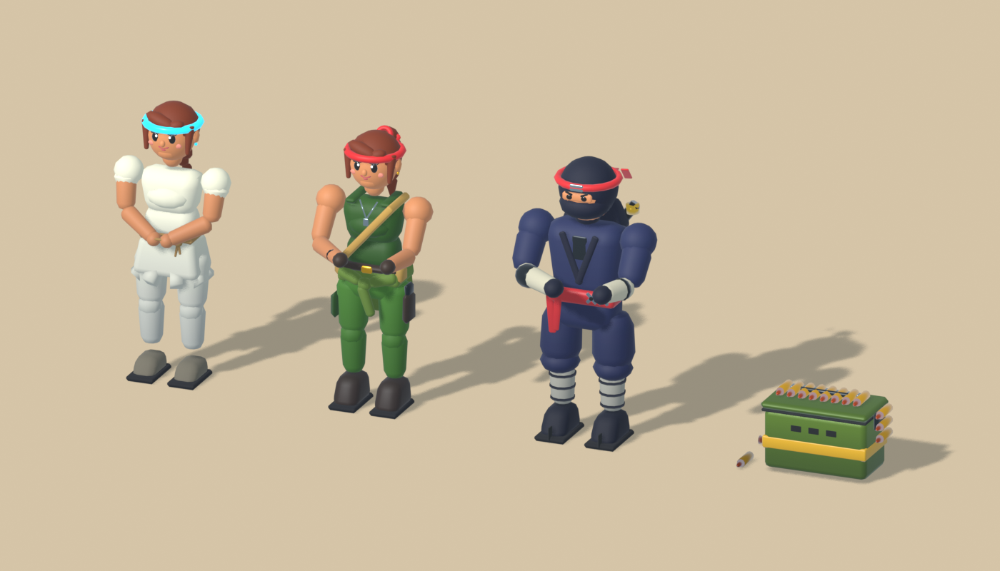
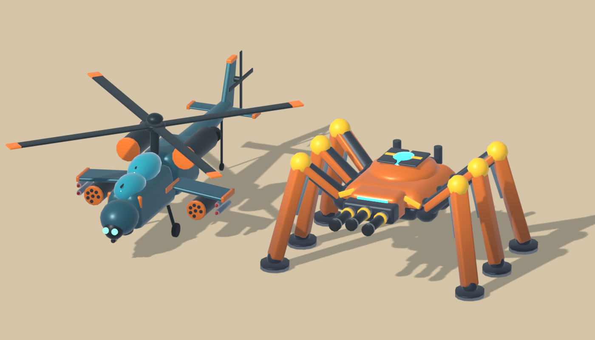

# Stylized AAA pass: Blender art, look, game feel and logic fixes

## Evaluation

The previous library was functional but read as grey-green blocks from the gameplay camera:

- **Colour.** Every material baked a 128 px noise texture whose sRGB values were authored as if they were linear, so the whole palette rendered darker and muddier than intended. ACES tone mapping then desaturated it further. Player, enemies, vehicles and terrain shared the same olive/sand range, and the player was identifiable mainly by the cyan ring.
- **Silhouettes.** Soldiers were stubby boxes with ball hands. All eleven weapons shared one receiver/barrel silhouette. Snow pines rendered as glassy grey cones and palms as flat triangles. Tanks were rectangles with no readable turret or wheels.
- **Readability.** Enemy roles only tinted a khaki uniform, allies were identical to the hero, and enemy tanks were identical to the player's tank.
- **Terrain.** The ground, about 80% of every frame, was a single flat colour per stage.
- **Cost.** The 44 GLBs totalled 9.2 MB (budget 9.65 MB), mostly repeated noise textures. Soldiers were 12.9K triangles each and are instanced by the hundred on Crazy.

The quality bar is the stylized AAA look of games such as Mario Kart 8 or Brawl Stars: chunky toy-like forms, soft bevels, saturated glossy paint, strong silhouettes and clear team colours. It is used as a bar, not a source; every model here is original and procedurally authored.

## Blender pipeline

`art/style.py` is a shared kit used by every generator:

- **Painted light.** Each material is a colour factor multiplied by one shared 2 × 32 px neutral ramp: cool shadow at the bottom, warm light at the top. `paint_height()` maps each exported asset's height onto that ramp, which gives every model a hand-painted ambient-occlusion gradient for a few hundred bytes per file.
- **Colour as a factor.** Colours are authored as sRGB swatches and exported as `baseColorFactor`, so runtime variants recolour a clone cleanly. This covers infantry roles (`Sand canvas`), hostile armour (`Vehicle paint` and `Vehicle trim`) and allies (`Hero bandana`).
- **Primitives.** Soft-bevel boxes, tapered boxes, capsule limbs, side-profile prisms and fat tyres with lugs. Bevel segments scale with part size, so small details stay cheap.
- **Culling.** Materials cull back faces except foliage, and there are no physical-material extensions.

Contracts kept: file names, joint names and pivots with identity rest rotation, weapon grip origins, mount and muzzle joints, the house footprint (5 × 7 m), the ruin wall (4 × 2.4 × 0.45 m), the prison slab top (0.24 m), the relay-house doorway and extras, the prison gate, and the blade material names.

| Asset group | Change |
| --- | --- |
| Hero commando | Green fatigues, bare arms, black hair with a red bandana and tails, brass bandolier. The two-handed rifle hold reads from above. |
| Hostile rifleman | Khaki uniform and helmet (tinted per role), crimson helmet band and shoulder pads, goggles. |
| Captive / allies | Ivory prisoner clothes and a cyan headband. Rescued allies (commando model) get cyan bandanas at runtime. |
| Weapons | Eleven distinct silhouettes: tan-furniture rifle, pump shotgun, belt-fed MG with bipod, scoped sniper, twin-tank flamer, revolver-drum launcher, compound bow, banded rocket tube, white/cyan laser, frag and gas grenades. |
| Vehicles | Toy-proportioned tank with a sloped hull, bright road wheels, cupola and pennant. Jeep with flared fenders, fat tyres and a mounted shotgun. Knobby-tyre scrambler. |
| Bosses | Charcoal gunship with crimson stripes, a gunmetal spider with glowing core and hazard legs, a navy laser tank with cyan capacitors, a vivid blue quad mech, an orange rocket mech and a desert-yellow missile truck. Every mount is unchanged. |
| Scenery | Serrated V-folded palm fronds on a stacked-shingle trunk. Tiered pines with snow caps. Faceted rocks. A framed ammo crate with stencils. A tent, a watchtower with sandbags and a red roof, a stucco city house with awnings, a glossy fuel drum and a patrol boat. |
| Kits | The relay barracks (sand plaster, crimson roof trim), prison and treasure, and ruin wall use the new palette with unchanged geometry. |

Size and cost: the 44 GLBs now total about 4.2 MB, against 9.2 MB before. Soldiers dropped from 12.9K to about 5.7K triangles and the tank from 22K to about 12K. Palms stay at about 1.3K. `tests/assets.test.mjs` now enforces a 5.5 MB total, per-model triangle budgets for instanced crowds and scenery, and the recolour material names.

## Engine look

- **Tone mapping.** Khronos PBR Neutral replaces ACES; ACES and AgX both desaturated the painted palette in side-by-side captures. The light rig pairs a warm key with a cool sky fill and warm ground bounce, and the environment reflection is a little stronger for glossy paint.
- **Painted ground.** `groundPaint()` (in `src/surfaces.ts`) paints each stage with seeded multi-octave shade/light patches and biome accents: blue ice streaks, scorched volcanic ash, dirt clearings in the jungle, dry patches in the desert and dark mud. City stages get 4 m paving. The tiling soil noise remains as bump detail.
- **Palettes and fog.** Stage palettes are warmer and more saturated, and fog density drops from 0.009 to 0.006, so the top of the screen no longer washes out.

## Game feel

`src/feel.mjs` (unit-tested) collects presentation events from the simulation. `src/feedback-ui.ts` draws them with pooled, fixed-size DOM.

- **Hit-stop.** A 35 ms freeze on kills, up to about 125 ms on bosses, with a cooldown so automatic fire never stutters. It runs in the frame loop, so tests that call `Game.update` stay deterministic.
- **Camera shake.** Trauma-squared shake from blasts (scaled by distance), heavy kills and incoming damage. It is off with *Reduce camera motion*.
- **Hit markers.** Floating damage numbers show the damage actually dealt, never overkill, and are coloured for rear hits, armour deflection and kills. The crosshair flashes on hits and kills.
- **Damage and streaks.** A red arc around the player points at each damage source, and a low-health pulse appears under 30% HP. Kill-streak banners run DOUBLE KILL → RAMPAGE → ONE-MAN ARMY, plus COMMANDER DOWN for bosses.
- **Audio.** Sounds are layered noise and tone recipes through a bus compressor: gun crack, blast thump and rumble, armour ping, a streak chime.

## HUD and guidance

- **Top message feed.** The boss bar, combat notices and hints, interaction prompts and Vale's radio stack in one feed at the top centre. On desktop it sits between the objective panel and the minimap, on portrait phones just below them, and on landscape phones in the top gap. Previously the radio, hints and prompts sat around screen centre, over the player.
- **Identity ring.** The cyan ring is depth-tested and placed at the local ground height, so the soldier stands on it instead of being painted over. It widens to sit around an occupied vehicle.
- **Guide arrow.** `src/guidance.mjs` (unit-tested) picks the next goal: the relay, then the nearest living relay guard or command boss, then extraction. For the relay and extraction the arrow points 10 m ahead along the mission road the player is on, so it follows zigzag, O, U and S routes instead of pointing through buildings. A chevron around the ring shows the heading, colour-coded by goal, and hides within 4.5 m of the goal. The current objective line shows the remaining distance in metres.

## Vehicles, finishing and the volcano

- **Vehicle loadouts.** Jeeps and tanks add their mounted gun (jeep shotgun, 16-shell tank cannon, up from 6) to your collected weapons instead of locking you to it. Boarding, pickups and empty magazines always select the strongest weapon that still has ammunition. An empty mounted gun falls back to a carried one.
- **All clear.** When a kill leaves no hostile alive and none still to come (finales need their command bosses spawned and dead), the mission ends immediately, as if you had reached extraction.
- **Cinderfall rockfall.** One rock on the player and one on the nearest enemy every 9 s, down from three every 5 s. The warning is 3 s instead of 1.8 s, and the rock descends visibly over the whole warning.

## Debrief and quartermaster

`src/debrief.mjs` (unit-tested) grades each level with up to three stars: complete it, beat a par time derived from the route length (75 s + 0.9 s per metre, +90 s for finales), and finish above 50% health. The debrief tallies banknotes ×10, gold ×25, diamonds ×75 and 10 credits per star, counts the banked total up and saves each level's best stars; stage cards show ★ n/9. The quartermaster shop presents Field Kit ranks and one-mission weapon supply drops as icon cards with a credit wallet. `art/build_ui_icons.py` renders the stars, coin, treasure, upgrade emblems and weapon icons in Blender from the same kit and GLBs.

## Sound

`src/audio.ts` synthesizes every cue with Web Audio, using noise bursts, filtered tones and a small brass-and-drums sequencer:
- **Levels:** loudness trims come from offline renders. Player guns peak about -16 to -26 dBFS, enemy fire about -30, explosions and the tank cannon about -7 to -10, and stingers about -7 to -10, all through a bus compressor.
- **Position:** world-positioned cues fade over 46 m and pan by screen side.
- **Performance:** each cue has a minimum repeat spacing and there's a cap of 36 voices, so a 260-cue burst schedules in milliseconds and every voice is released.
- **Music:** stingers are one-shot and 2.1 s or less, with no loops (unit-tested). Effects duck briefly under them.
- **Settings:** separate Sound effects and Music switches; switching both off suspends the audio context.

## Background music

`src/music.mjs` (unit-tested) composes one original heroic theme as note data: a 16-bar melody over i–VI–III–VII–iv–VI–V–i, with a B section that answers an octave higher. Each stage arranges it in its own key, tempo, lead colour and percussion style. The final stage is in major, and each finale has a boss variant about 10% faster with taiko and brass stabs. `src/music-render.ts` synthesizes a theme once through an `OfflineAudioContext` with brass, string pad, bell, pluck, flute, bass, timpani, taiko, snare and cymbal voices, plus a small hall reverb.

The loop is made seamless by folding the release tail into the start and adding a 3 ms edge fade. Every theme is normalised to the same peak. Measured in Chromium:

| | |
| --- | --- |
| Main-thread cost | 9–22 ms, once per theme |
| Render time | 1.6–2.9 s on the audio thread |
| Loop length | 28–40 s |
| Memory | about 4–5 MB per cached loop (at most three kept) |
| Loop seam | 0 |

Playback is a single looping buffer source. The briefing pre-renders the next stage theme, and finales pre-render the boss version. The theme dips under stingers and while paused, stops at the result screen, and follows the Music switch.

## Rescue door fix

When a prisoner was freed from beside the door, the gate's front stub walls could land 1.5 cm inside a soldier standing there. `moveCircle` then rejected every step except backing away. The stubs now stay inside the closed prison's footprint, and `resolveOverlap()` pushes the player and allies out of any collision that changes around them. Unit and browser tests replay the case.

## Logic fixes

1. **Stage picker.** The picker silently wiped credits, the "permanent" Field Kit and the squad. Re-picking the current stage now keeps the saved level. Deploy is labelled *DEPLOY TO STAGE N* and explains what carries over. Switching stage or replaying keeps credits, Field Kit, squad and best score.
2. **Auto-select.** Auto-select equipped the limited frag grenade (priority 40 above the rifle's 30) after pickups, an empty M249 or an empty tank cannon, so held fire threw the whole supply. Throwables are now never auto-selected while any gun has ammo, and an ammo pickup no longer overrides a manual weapon choice unless the held weapon is dry.
3. **Frag crates.** A frag crate reduced Field Kit rank 2–3 grenade reserves to 4. Pickups can no longer lower reserves.
4. **Salvo warning.** The boss "HEAVY SALVO / TAKE COVER" warning was overwritten on the next tick. It now stays up until the blast zones resolve.
5. **Boss health bar.** The bar refilled when one of several bosses died. It now sums every boss.
6. **Cover grid.** The grid rebuilt only when `COVER.length` changed, so a prison opening and a destroyed prop in one tick left stale collision. Every mutation now invalidates it.
7. **Gunship landing.** The gunship could pick saplings or explosive crates as landing cover and re-sorted all cover every frame. The landing spot is now cached and excludes both.

Performance: `segmentBox`, the innermost collision primitive, no longer allocates. It is bit-identical over 200,000 random cases and 2.5–3.5× faster, which covers enemy line-of-sight scans. Character poses reuse scratch objects, and corpses stop walking their meshes every tick.

## Validation

- `npm test`: node unit tests, including the new feel, material-contract and triangle-budget tests.
- `npm run build` and the full Playwright suite (`npm run test:e2e`) run locally.
- Before/after model renders and in-game captures on all seven biomes, compared at the gameplay camera. `docs/aaa-models.png` and `docs/aaa-gameplay.png` are real Blender and Three.js captures, not concept art.

## Relay checkpoint, boss phases and smarter allies

- **Relay checkpoint.** Securing the relay snapshots the mission: supply seed, health, shield, weapons and ammunition, treasure, score, time, killed patrols, freed prisons, remaining supplies and vehicle state. After a defeat, **RETRY FROM RELAY** rebuilds the identical mission from the same seed, replays that progress and restarts the relay counterattack. **RETRY MISSION** still starts over.
- **Boss phases.** Command bosses take 1.5× damage in downtime windows: gunship landed, spider resting, quad-mech guns cooling, the laser tank venting for 1.4 s after a beam, and missile bosses reloading for 1.8 s after a salvo. Hits land as gold weak-point numbers. At half health a boss enrages and its attack clocks run 30% faster; the boss bar glows gold or red to match.
- **Allies.** Each ally engages the nearest enemy it can see within 18 m, checked against cover, even while the player holds fire. With no target in sight, it covers the player's aim.

## Late-stage reinforcements

`art/build_cast.py` builds the new cast in the shared kit and saves the editable `art/cast.blend`. Before export, `merge_static()` joins each joint's static parts into one mesh, with one primitive per material. Joints and silhouettes are unchanged, and draw calls drop by about 60%. The walker goes from 103 meshes to 38 primitives, the Sky Wraith from 84 to 22 and the ammo box from 47 to 9. The seven GLBs add 0.97 MB, leaving the library at 5.38 MB, under the 5.5 MB budget.

| Asset | Design |
| --- | --- |
| `captiveWoman` | Ivory tunic with a torn hem, a rope belt and bound wrists, an auburn braid and a cyan headband. The face has lash lines with a flick, catch-lit eyes, a smile and blush. |
| `commandoWoman` | Fitted tank top, cargo trousers, a jacket knotted round the hips, dog tags, a thigh holster and a high ponytail. The bandana uses the "Hero bandana" material, so allies turn it cyan. |
| `ninja` | Deep indigo gi, not flat black, so the painted light still shapes it. Crimson sash and headband with long tails, a hood and mask with an eye slit, bandage wraps with steel bracers, tabi and a lacquered scabbard. Holds `weapon_katana`, a curved blade with a gold tsuba and a crimson silk wrap. |
| `ammoBox` | Olive M2-style can with a yellow stencil band and a linked belt of brass rounds draped over the lid. It replaces the striped ammo crate. |
| `skyWraith` | Teal tandem-seat attack helicopter with orange trim, a sensor turret, a chin chain gun (`AuxGun`/`MuzzleAux`), rocket pods (`Pod0/1`, `Launch0/1`), a `Rotor` and a `TailRotor`. |
| `walker` | Six armoured mech legs (`Leg0`–`Leg5`) in a tripod gait. It has a triple-cannon head (`Muzzle0`–`Muzzle2`) and hinged `Vent0`/`Vent1` plates that open over a teal core when it overheats. |

Character rigs keep the commando joint hierarchy, so `CharacterMotion` animates them unchanged. One pitfall: `limb()` bevels every edge sharper than 30°, so limbs must keep 12 sides. With 10 sides the triangle count rises by about a third.

**Stage schedule.**

- Stages 1–2 are unchanged.
- From stage 3, sword soldiers make up 20% of patrols.
- Ninjas appear from stage 5 (15%) and rise to 20% in stages 6–7.
- The IRON SOVEREIGN escort joins the stage 6 and 7 finales on Normal and above. Kinds alternate, so Crazy fields two of each.
- Stage 7's boss is now the SKY WRAITH, replacing the repeated spider.

**Tuning against Steel Front.**

- Steel Front's helicopter rockets deal 70 against a 240 HP tank; here they deal 30 against a 150 HP commando.
- Walker shells drop from 33 to 16 damage.
- The gun run uses an odd number of rings, so one is always centred on the player. Moving along the line never escapes it; stepping sideways does.

## Suggested next steps

- route-progress encounter triggers and difficulty that scales AI, not just head count
- interpolated rendering on 120/144 Hz displays
