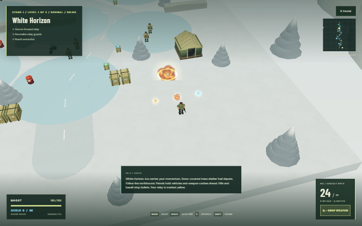
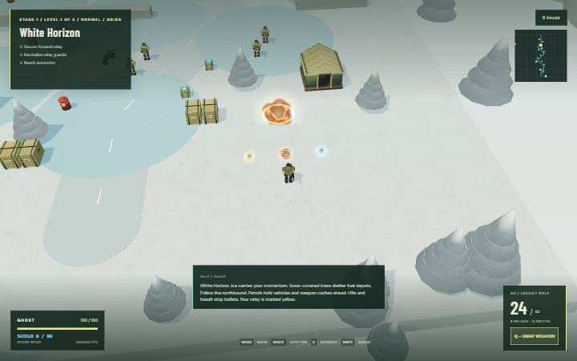

# Combat feedback and strongest-weapon selection

## Player behavior

Every weapon hit now produces a visible impact burst. Kinetic rounds make amber flashes and spark streaks; sniper hits are larger; flames burn orange; lasers flash cyan; gas damage produces green puffs. Explosive weapons create a growing fireball, an expanding ring and drifting smoke at the impact position. Hits on airborne enemies explode at the enemy's height. Damage, collision, cover protection and blast radius remain governed by the existing combat rules.

Picking up a weapon or exhausting its magazine **and** reserves automatically selects the highest-priority usable weapon in the collected inventory. A weapon with an empty magazine but remaining reserve remains eligible and reloads normally. Collecting a weaker weapon does not downgrade the best weapon or interrupt its reload. Q / SWAP still cycles manually; automatic selection does not run every frame to undo a deliberate choice.

Auto-equip uses authored overall combat tiers, accounting for sustained fire, range and special capabilities rather than just damage per bullet:

| Priority, strongest first | Weapon                           |
| ------------------------- | -------------------------------- |
| 1                         | Laser                            |
| 2                         | Anti-armor missile / tank cannon |
| 3                         | Machine gun                      |
| 4                         | Sniper                           |
| 5                         | Grenade launcher                 |
| 6                         | Explosive bow                    |
| 7                         | Flamethrower                     |
| 8                         | Fragmentation grenade            |
| 9                         | Rifle                            |
| 10                        | Shotgun                          |
| 11                        | Gas grenade                      |

This is a general-purpose selection order, not a claim that every weapon is superior in every tactical situation. The tank's six-shell cannon participates in automatic selection and wins ties with the personal missile weapon. When its shells are exhausted, firing falls back to the strongest usable personal weapon. Jeep mounted fire remains fixed. Ammunition is never added by selection, and existing switch/fire cooldowns remain enforced.

## Rendering and review

The impact system reuses burst groups, sprite materials, two small procedural textures and one ring geometry. It caps concurrent bursts at 12 in Low and 28 in High, with fewer sparks and smoke sprites in Low. Closely spaced pellet/flame hits share a burst, while damage is still applied per projectile. Bursts fade within 1.15 seconds and clear on restart. A restart review caught detached pooled groups after the world cleared its actor group; reused effects now reattach when emitted. Colored flame shapes use normal blending so they remain visible on bright snow.

## Validation

Regression coverage checks all eleven weapon impacts in both graphics modes, airborne explosion height, bounded effects under repeated fire, expiry, restart reuse, strongest-weapon pickup/fallback, reload preservation, manual selection, tank cannon eligibility and separate ammunition. Existing vehicle tests continue to fire every weapon through manual selection. Screenshots cover both detail modes.

The production build, all 24 Node logic tests and all 48 browser tests passed. Both graphics modes were visually reviewed. GitHub Actions repeats the checks before publishing.

