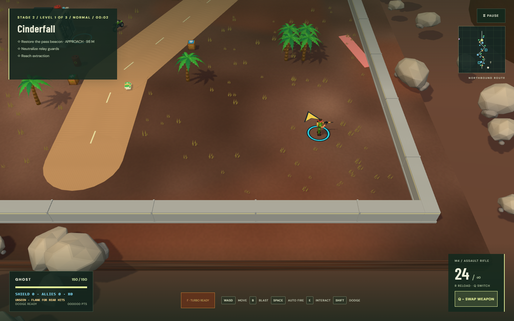
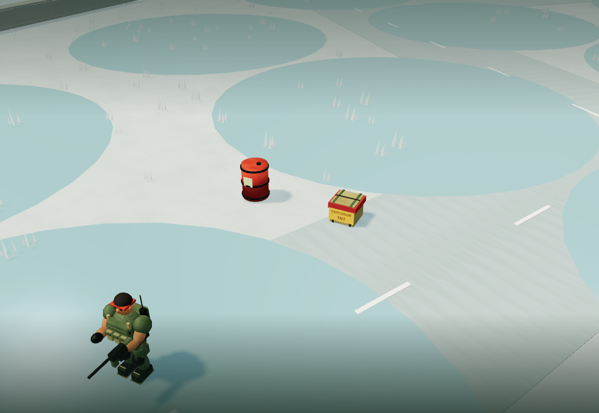
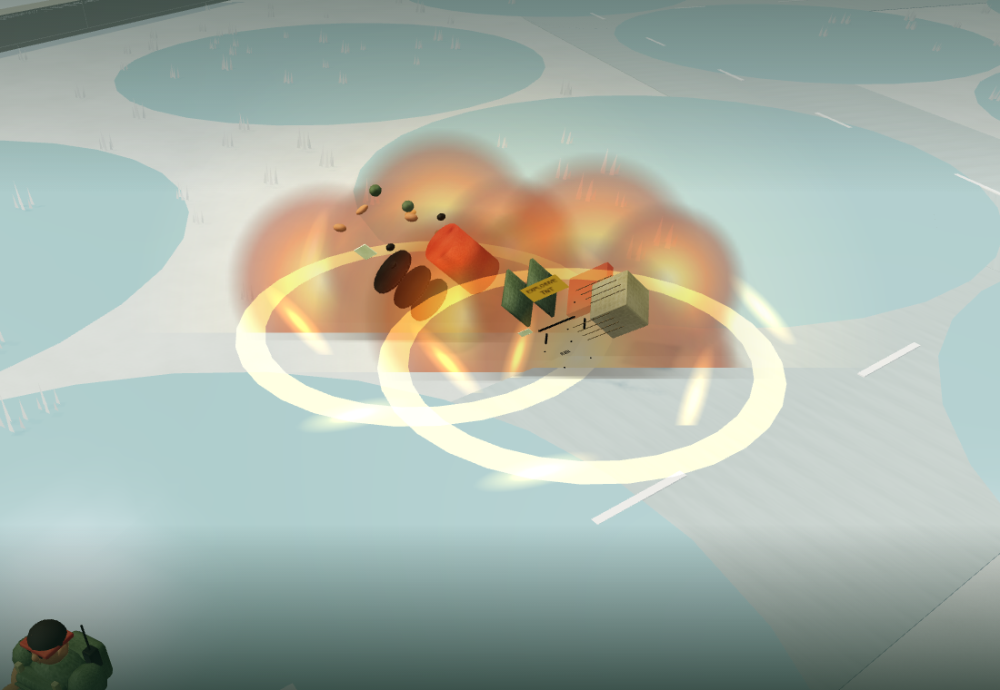

# Perimeter, explosive stores and tank tree crushing

## Player behavior

- All 21 levels have continuous, long concrete walls on all four physical map edges, including O, U, S and diagonal routes. Their inside faces match the existing world limits. The walls stop movement and bullets and cannot be destroyed. Cap bands, footings and regularly spaced joints make the border visible.
- Established roadside fuel depots now mix fuel drums with wooden explosive-material crates. Every third depot is a crate with a red band and yellow **EXPLOSIVE / TNT** signs. Placement keeps the existing road and vehicle clearances.
- Either store detonates when damaged enough by gunfire or a blast. A textured orange fireball, expanding ground shockwave, outward sparks, smoke and fragments show the danger. Fuel and crates can trigger each other and destroy nearby trees.
- Blasts extend 5.5 metres, with damage decreasing toward the edge. A nearby ordinary soldier can be killed; a soldier near the edge can survive wounded. The maximum damage budgets are 180 for enemies, 55 for the player, 100 for vehicle armor and 240 for destructible props. Actor size extends contact with the radius. Buildings and solid walls block damage. Soft trees and other explosive stores do not shield a blast.
- Occupied vehicles absorb the blast with armor through the existing damage and emergency-exit system. Short existing-style hit protection prevents simultaneous chain blasts from draining the player's armor/health multiple times instantly. Parked vehicles also take damage and break apart when destroyed.
- BOARD, EXIT and nearby-objective prompts appear for one second, fade during the last quarter-second, then remain hidden while the interaction stays the same. Reduced-motion settings omit the fade. Moving away and returning, or boarding/exiting, creates a new hint. Keyboard **E** and the mobile **USE / BOARD / EXIT** button keep working after the hint disappears.
- A driven tank crushes small trees and small snow trees, producing the same leaves/dust as shooting them. Movement is exactly half its otherwise applicable speed while the hull crosses the tree footprint, including existing terrain modifiers. It returns to normal after clearing the footprint. Big trees, buildings and perimeter walls remain solid. Jeeps and motorcycles cannot crush trees. A tank cannot crush a tree through a wall.

## Implementation and review

`src/environment.mjs` holds the perimeter geometry, depot mix, blast falloff, small-tree rule and one-shot hint timer. Both layout branches call the same finalizer so every stage receives the same behavior. Concrete meshes reuse the existing static terrain batching; explosive crates reuse the authored Blender crate with added warning labels. No additional model download is needed.

`Game.damageProp` removes a detonating prop from collision and damage collections before chaining. This prevents recursive re-detonation and duplicate score. The main environmental shockwave is emitted after victim/tree effects so a crowded explosion cannot immediately evict it from the bounded impact pool. Existing particle and fragment lifetimes and quality caps remain in force.

`Ride.drive` computes a swept hull movement against solid obstacles first, checks contact with small trees, then applies the 0.5 movement multiplier before destroying only the trees the actual movement touches. Temporary slowdown footprints remain only while the tank overlaps the felled trees. Wheel animation uses the actual travelled distance.

The hint timer uses elapsed wall-clock milliseconds and an interaction identity, not the render frame count. Existing companion extraction warnings can still take precedence when they are needed.

## Validation coverage

- Unit checks inspect all 21 maps for sealed, indestructible walls, both explosive-store types, boundary movement and blocked gunfire. Falloff and the one-second timer have deterministic checks.
- Browser checks fire real bullets into both fuel and TNT in Low and High graphics, verifying close kills, edge wounds, cover protection, player damage, outward particles and no duplicate scoring.
- Mixed chain checks verify occupied vehicle armor, debris cleanup and effect expiry.
- Tank checks measure actual movement at half speed, normal recovery, and intact big trees, walls and trees behind walls. Motorcycle and jeep behavior is also checked.
- PC and mobile checks wait past prompt expiry, then board and exit with keyboard/touch controls and verify that returning triggers a new prompt.
- Perimeter checks verify projectile blocking, movement limits and indestructibility, with a captured corner view in `perimeter-explosives.png`.

The PC/mobile hint checks record visibility transitions with a browser-side observer, so a slower test runner can verify an appearance even after its one-second window has expired. The separate deterministic timer test still checks expiry at exactly 1,000 milliseconds. These UI checks use Low graphics, matching the standard CI contexts; the blast checks separately exercise both graphics modes.

The older laser-boss fixture put the player exactly on the map edge. It now places both actors inside the perimeter so that it continues testing warning/fire timing; the new perimeter test independently checks wall shielding.

Browser automation uses software rendering. Its regression and draw-call checks do not establish frame rates on physical phones or PCs.

## Local release checks

- `npm test`: 31 passed.
- `npm run build`: passed TypeScript checks and production bundling.
- `npm run test:e2e` with `CI=true`: 61 passed in 8.6 minutes.
- The 660-enemy crowded-combat scenario stayed within the existing budgets: 811 draw calls in Low, 985 in High, with bounded effects.
- PC/mobile gameplay, perimeter and close-up explosive-store screenshots were reviewed.

## Visual review

The perimeter corner was captured at the gameplay camera distance. The explosive depot and chain reaction were inspected with a closer camera to check the warning labels and separated model fragments.

