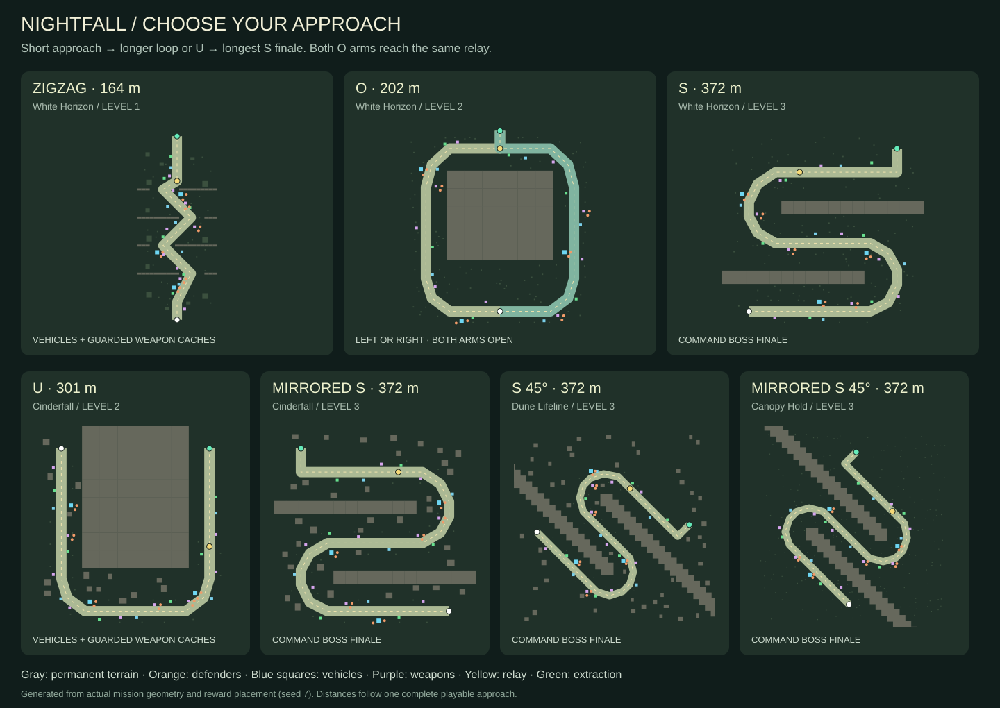
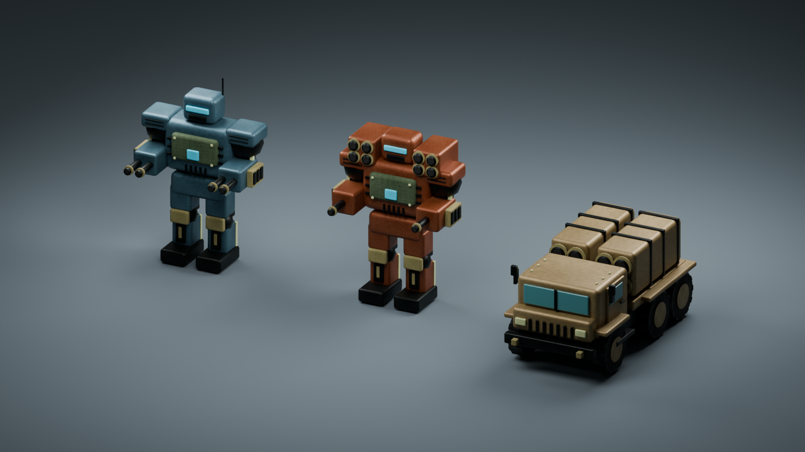
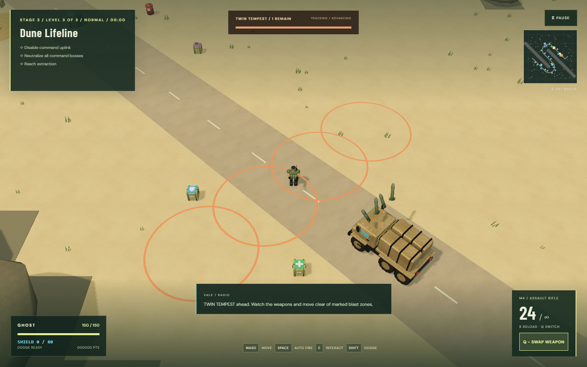
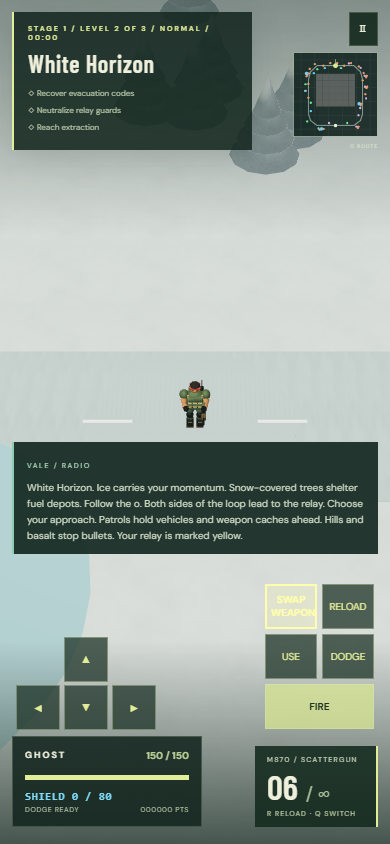

# O loops, route progression and command bosses

This release supersedes the level order in [Square expeditions](SQUARE_EXPEDITIONS.md) (including its diagonal variants). The campaign still has seven biomes, three levels each and the same save indices.

## Route design and implementation

1. Keep the introductory zigzag at 164 metres. Preserve its familiar encounter positions and terrain behavior.
2. Replace L layouts with a complete O loop. Enter at the southern junction and choose the left or right arm around a permanent central hill. Both arms meet at the northern relay; extraction is on a shared short spur. No menu choice is required, and players can turn back to explore the other arm.
3. Put O/U routes in level two and the longest S variants in level three. Length means the shortest intended road journey from insertion to extraction, not the sum of optional branches. Either O arm is about 202 m; its unique road network is about 392 m. U is 301 m and S is 372 m. The finale is therefore the longest required route in every biome.
4. Preserve regular S, mirrored S and both 45-degree variants. Regular square maps are 136 by 136 m; diagonal maps are 196 by 196 m. Hills and volcanic basalt divide route arms and cannot be destroyed by gunfire.
5. Render every road branch in the world and tactical map. Use the same geometry to exclude scenery, reserve vehicle bays, distribute supplies and place patrols. O relay reinforcements spawn at the shared junction so either approach can finish.
6. Put ten of the twenty supply crates along each O arm. Alternate within each reward type so each side gets four or five weapons, three health crates and two or three shields; alternating raw list indices would bias almost every weapon to one arm. Keep nine additional weapons, six health and five shield crates overall. Bike and tank bays sit on one arm and the jeep on the other; each vehicle and premium weapon cache retains defenders. Rewards keep a tank-width approach from the road, spacing from every other road arm and clearance from solid objects, fuel and dangerous terrain.

| Biome          | Level 1           | Level 2 | Level 3               | Finale boss                |
| -------------- | ----------------- | ------- | --------------------- | -------------------------- |
| White Horizon  | Zigzag            | O       | S                     | Cobra Fang helicopter      |
| Cinderfall     | Zigzag            | U       | Mirrored S            | Iron Widow spider          |
| Dune Lifeline  | Zigzag            | O       | S 45 degrees          | Twin Tempest missile truck |
| Canopy Hold    | Zigzag            | U       | Mirrored S 45 degrees | Fourfold Titan             |
| Citadel Dawn   | Zigzag            | O       | S                     | Prism Mammoth laser tank   |
| Faultline Zero | Southbound zigzag | U       | Mirrored S            | Siege Colossus             |
| Mire Crossing  | Zigzag            | O       | S 45 degrees          | Iron Widow spider          |

## Blender art plan and delivered models

Use actual Blender geometry and editable joint hierarchies rather than runtime placeholder meshes. `art/boss_assets.py` extends `art/build_assets.py`; running Blender exports 35 GLBs into `public/models` and saves the assembled source gallery in `art/nightfall.blend`.

- **Fourfold Titan:** a giant steel-blue humanoid with two cannons on each hand. Hip, knee, shoulder, elbow and head pivots animate its gait, recoil, impacts and collapse. Armor plates, cooling vents, hydraulic rams, ammunition feeds, barrel collars and inset bores distinguish its silhouette.
- **Siege Colossus:** an oxide-armored humanoid with one hand gun per arm and two shoulder rocket magazines. The rockets and guns fire from separate named Blender mounts. Its walk and death use the articulated humanoid rig.
- **Twin Tempest:** a six-wheel armored truck with two missile magazines, launch tubes, pivoting pods, turning wheels, cab glass, grille, mirrors, boarding steps and protected lights. Its visible wheel rotation follows actual movement; the pods elevate while locking an attack.
- **Existing bosses:** add a separate light-gun cradle, barrel and ammunition feed to the helicopter, spider and laser tank. Each has its own `MuzzleAux` pivot and independent attack timer. The playable tank keeps its existing player weapon.

Materials use packed surface textures, metallic armor and contrasting optics. Rigid geometry is merged only within joint boundaries so animation stays intact. Shared asset loading, Low/High quality settings and existing mobile controls remain in use. The checked combined GLB budget is 9.5 MB; native Blender source is not downloaded by the game.

## Combat design

| Weapon                    |        Damage | Cadence / warning                                     | Player response                                 |
| ------------------------- | ------------: | ----------------------------------------------------- | ----------------------------------------------- |
| Titan four-gun burst      | 10 per bullet | Four shots every 0.8 s; six volleys then 2.4 s reload | Strafe the narrow fan and advance during reload |
| Colossus hand guns        |  8 per bullet | Two shots every 0.9 s, independent of rockets         | Keep moving while watching ground warnings      |
| Colossus shoulder rockets | 34 per impact | Three zones; 1.6 s warning; 5.2 s cycle               | Leave the 3.6 m radius rings or use cover       |
| Tempest twin missiles     | 40 per impact | Four zones; 1.9 s warning; 6.5 s cycle                | Escape the broad line of 4 m radius rings       |
| Existing boss light gun   |  6 per bullet | One shot every 0.95 s, within 28 m                    | Avoid lingering between the main attacks        |

Existing helicopter/spider primary volleys and laser-tank beam retain their tuning. Auxiliary fire pauses during spider rest and helicopter rearming. Heavy missiles leave visible launch mounts, arc toward fixed warning rings and do not home after launch. Warning radii match damage radii. Solid cover shields blast damage, and the existing brief invulnerability window prevents simultaneous impacts stacking unfairly. Pending salvos disappear when their owner dies.

New ground bosses use cover-aware navigation and collision, with local separation for multiple bosses. A missile boss must keep seeking a firing position when a wall blocks its view. Charging only stops movement when the target is visible and within range. Easy/Normal still have one finale boss, Hard two and Crazy four; difficulty does not secretly increase damage.

## Review and acceptance checks

- Traverse every segment of both O arms and all other missions using tank collision, including corners and shared relay/extraction areas.
- Verify route length strictly increases in each biome, all seven shape variants remain represented, and S rotation preserves length.
- Verify 630 seeded supply distributions across 21 missions: exact quotas, off-road distance, tank approaches, hazard avoidance and twelve cache defenders without increasing difficulty counts.
- Inspect GLB geometry, real joint hierarchies and unique muzzle/launcher mounts. Enforce the combined asset budget.
- Exercise both O approaches with game input, collectable rewards, shared relay guards and extraction.
- Exercise all six boss types, articulated movement, separate gun timers, broad missile warnings, launch origins, cover protection, death/fade cleanup and four-boss finale spawning.
- Regress the blocked-view missile movement bug with a real obstacle: the boss must go around it and resume firing without crossing collision.
- Run the existing weapon, vehicle, shield, mobile controls, difficulty, terrain, save, completion and retry tests on a fresh dev server, then build the production bundle.
- Visually inspect the Blender render, desktop High and mobile Low gameplay. Browser checks do not establish frame rates on physical phones.
- Commit to the existing public repository, push through the SSH remote, wait for the required full test/build/Pages workflow, then verify the public game and new assets.

## Validation record

- 24 Node checks passed, including all roads and both O arms, increasing route length, 630 seeded supply layouts, GLB geometry and joint validation.
- All 39 browser regression checks passed together on a fresh server, including both O approaches, six boss types, Crazy finales, cover-aware navigation, vehicles, weapons, mobile controls, save progression and defeat/retry.
- Production TypeScript/Vite build passed. The 35 GLBs total 9,089,448 bytes, below the 9.5 MB budget. Regenerated Blender exports are retained alongside the updated editable gallery.
- Desktop High visual fixtures show approximately 107–131 draw calls and 48k–111k triangles for the new encounters and O junction. These counts describe the captured scenes; they are not a physical-device frame-rate guarantee.
- Desktop High views inspected for all three new bosses and the O junction. Mobile Low inspected at 390 × 844: route map, touch controls, weapon swap and HUD work with no horizontal overflow or page errors.
- The final O-arm reward balance correction passed all 24 Node checks, the production build and 12 affected browser checks. Each arm has mixed supplies and remains tank-accessible. GitHub Pages release checks follow the required full CI suite.

