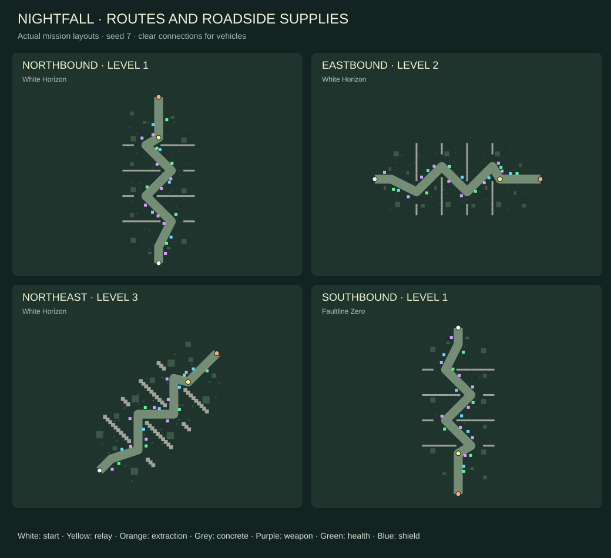
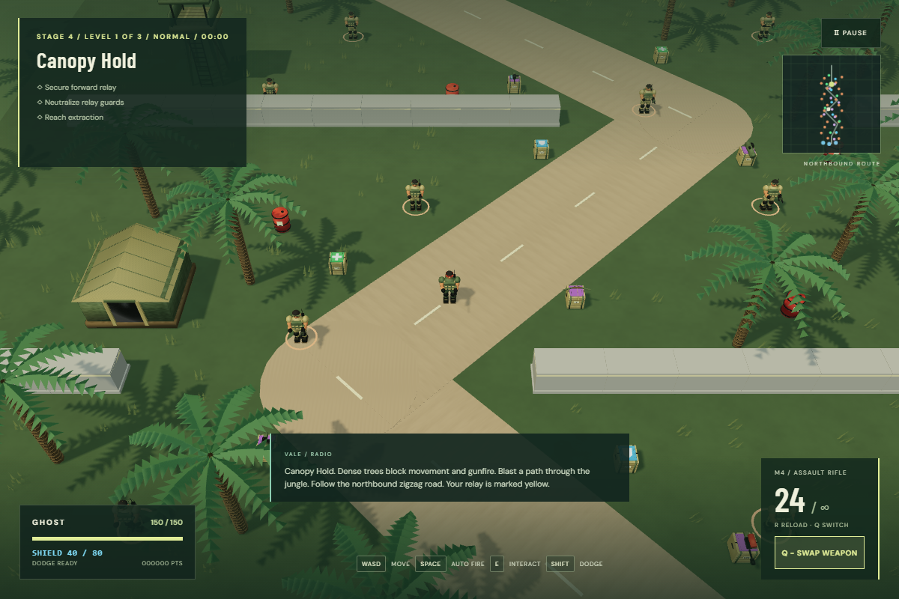
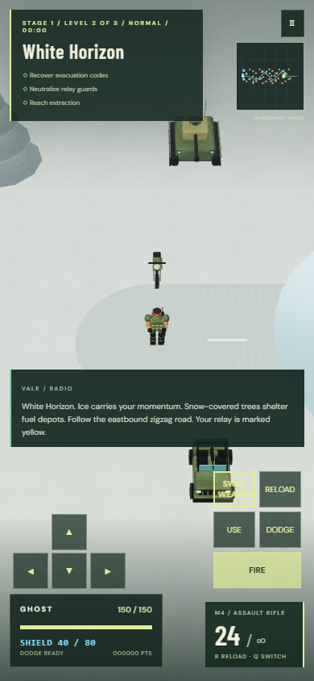

# Routes, supplies and boss attack plan

Current route order and boss roster: [O loops and command bosses](LOOPS_COMMAND_BOSSES.md). Older layout notes below are retained as release history.

The route-layout section below records the earlier four-direction release. [Square expeditions](SQUARE_EXPEDITIONS.md) supersede level 2/3 geometry and vehicle placement; supply and boss attack rules below remain applicable.

## Player experience

- Each stage keeps three long levels. Level 1 follows a northbound zigzag, level 2 turns east across the map, and level 3 follows a southwest-to-northeast zigzag. Faultline Zero's approach reverses south, giving a top-to-bottom route too.
- The road, concrete chicanes, spawn positions, vehicles, terrain, relay, extraction and tactical map use the same route geometry. Concrete gaps remain wide enough for a tank. The camera and WASD directions stay consistent.
- Weapon crates (all nine additional weapons), six medical crates and five shield crates appear throughout each route, slightly beyond its edge. Side and distance vary on each deployment. Placement is bounded, avoids solid objects and dangerous terrain, and must have a clear tank-width connection to the road. Full health/shield crates stay available until needed.
- Medical supplies retain vehicle repair behavior. Blue shield crates add 40 personal shield points up to 80; shields absorb damage before personal health. Vehicle armor remains separate. The HUD shows the shield reserve, and the tactical map shows the road and supply types.

## Boss attacks

- Gunships and spiders fire small three-round light volleys more frequently, with a short recovery after several volleys.
- Every sixth volley becomes a heavy three-impact salvo. Each impact has a broad blast radius, a fixed ground warning and time to dodge. Solid cover shields the player from the blast.
- Laser tanks charge a visibly wider heavy beam. Warning width and actual damage width match; aim locks during the charge. Cover stops the beam. Heavy attack frequency remains lower than light attack frequency.
- Difficulty continues to change enemy and boss counts, without secretly increasing projectile damage. Low detail keeps identical attack timing and collision rules.

### Attack tuning

| Attack               |        Damage | Timing                                                 | Coverage                                       |
| -------------------- | ------------: | ------------------------------------------------------ | ---------------------------------------------- |
| Gunship light volley | 10 per bullet | Every 0.60 s; 0.49 s below half health                 | Three bullets, narrow fan                      |
| Spider light volley  | 12 per bullet | Every 0.72 s; 0.59 s below half health                 | Three bullets, narrow fan                      |
| Heavy salvo          | 28 per impact | Every sixth volley, 1.4 s warning, then 4.4 s recovery | Three zones of 3.4 m radius, centers 5 m apart |
| Laser tank           |            32 | 1.2 s locked warning; 3.8 s cycle                      | 3.2 m wide beam, clipped by cover              |

Bosses do not initiate volleys during spider rest or helicopter rearming. The heavy attack replaces a light volley; it is not added on top of it. Invulnerability windows prevent simultaneous overlapping impacts from stacking unfairly.

## Implementation and review

1. Add shared route transforms, road sampling and seeded supply placement. Keep all mission systems in one coordinate system.
2. Render segmented roads and concrete chicanes, preserve biome detail, and update bounds, camera start and minimap.
3. Add recognizable medical, shield and weapon crate visuals using the existing Blender crate asset, plus reusable colored insignia.
4. Add shield absorption and collection rules, damage-based boss profiles, heavy telegraphs and matching collision footprints.
5. Verify every route with foot/tank clearance, seeded supply reachability and quotas, all difficulty counts, shield/vehicle behavior, heavy cover protection, boss frequency, pause/retry cleanup and existing regression tests.
6. Build, visually inspect desktop/mobile, commit and push over SSH. Wait for GitHub Pages CI and verify the public deployment.

## Review findings and fixes

- Replaced the fixed northbound start, road, vehicle placements and tactical-map coordinates with shared route geometry. Updated boss clamps and rotated boss formations so eastbound and diagonal missions cannot strand bosses or place vehicles outside the map.
- Kept prop model selection independent of rotated collision dimensions, rotated paired crates and cover prefabs with their collision footprints, and centered briefing camera views on the selected route.
- Carved a minimum 7.2-metre clear road corridor; concrete chicanes never close the tank route. The relay sits on the road and all extraction positions remain in bounds.
- Supply placement checks the whole polyline, including adjacent road arms at bends. Crates sit 4.4–6.4 metres from their sampled centerline and at least 4.2 metres from every road segment. Their approach has 2.5-metre clearance, avoids parked vehicles, and keeps medical supplies out of sand traps and mud holes.
- Kept shield capacity and overflow damage separate from vehicle armor; restarting clears temporary shields. Full crates remain collectable later.
- Locked the laser tank’s visible weapon to its warning direction and matched heavy laser warning width to collision width, clipped beams against cover, and prevented blast damage through solid cover. Pending heavy salvos are canceled when their boss dies.
- Separated defeat/result animation timing from the capped physics clock. Retry appears promptly even with two rendered frames per second; pausing still stops progression. A regression test explicitly throttles rendering.
- Changed browser tests to require a fresh development server. A reused server after live edits produced duplicate mission modules and invalid collision fixtures; the production bundle uses one module instance.
- Reused the existing Blender crate and weapon models with shared insignia geometry and materials. This adds no model downloads; Low retains the same collision and attack behavior.

## Validation results

- 20 Node checks passed, including tank traversal on all 21 layouts and supply quotas, safe approaches, off-road distance, hazard avoidance and seed variation across 630 generated distributions.
- All 30 browser regression checks passed during implementation. A fresh-server run of the 14 affected campaign, supply, boss, UI and completion checks passed after the final layout and visual changes. Five final boss and supply checks also passed after aligning the laser model with its locked aim. An additional geometry regression verifies crates, tents and towers against their collision footprints in all four directions. GitHub Actions requires the full suite to pass again before deployment.
- A simulated Easy level completed using movement, aiming and normal weapon damage.
- Desktop High views checked for all four directions. Mobile Low checked at 390 × 844 with touch controls, shield HUD and no horizontal overflow. No page errors in the visual checks. These browser checks do not measure frame rates on physical devices.

## Visual references

