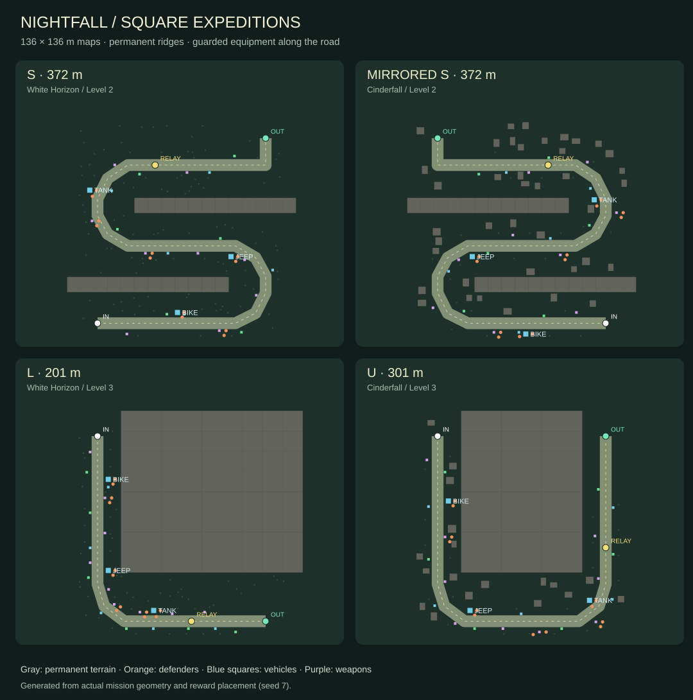
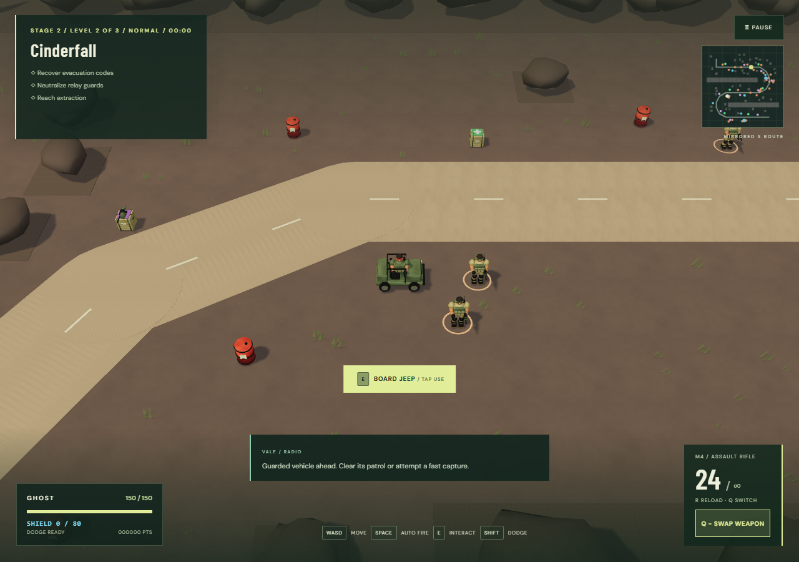
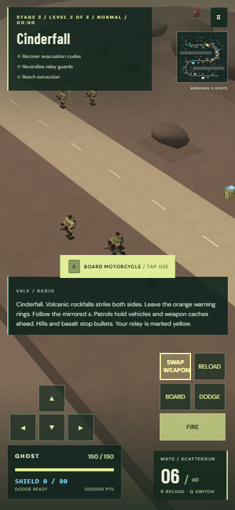
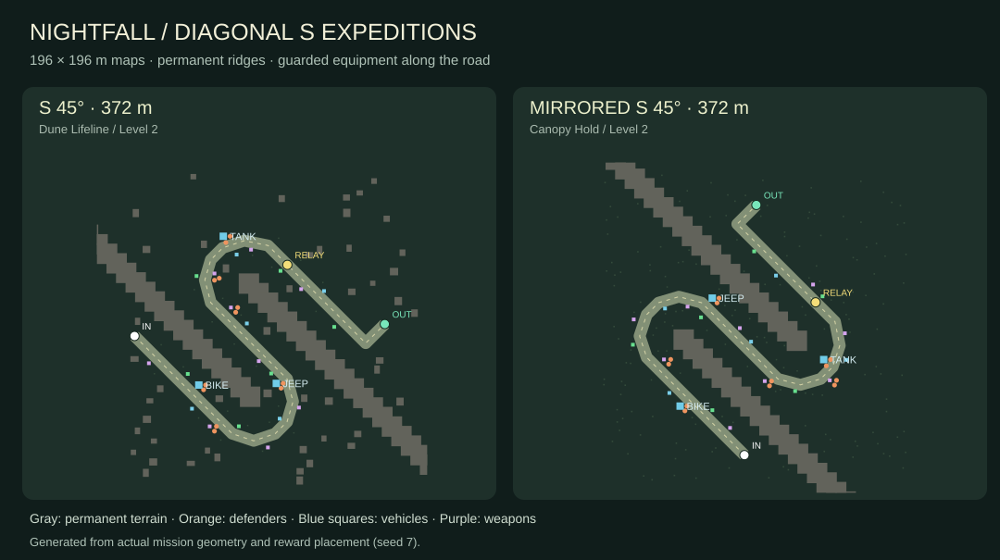
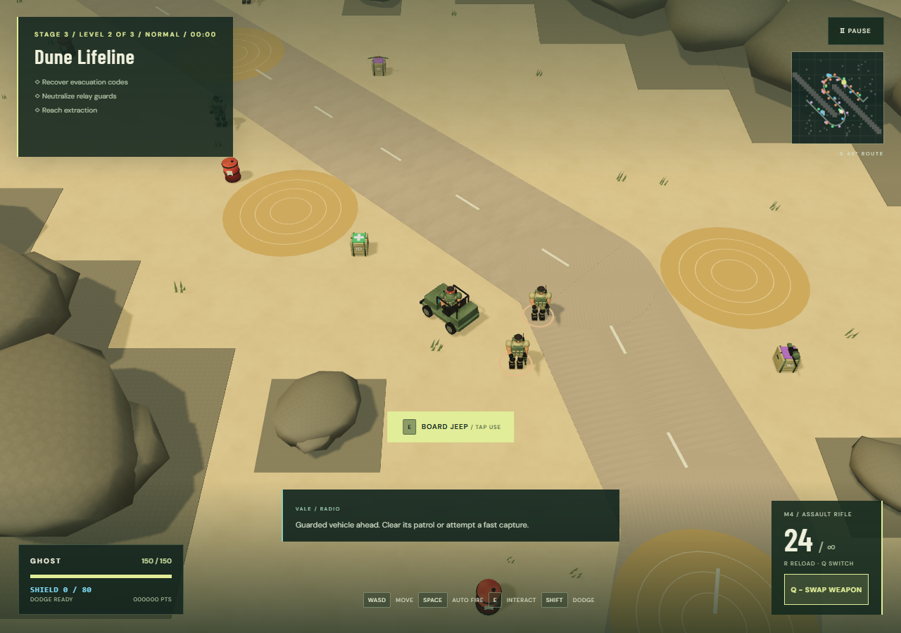
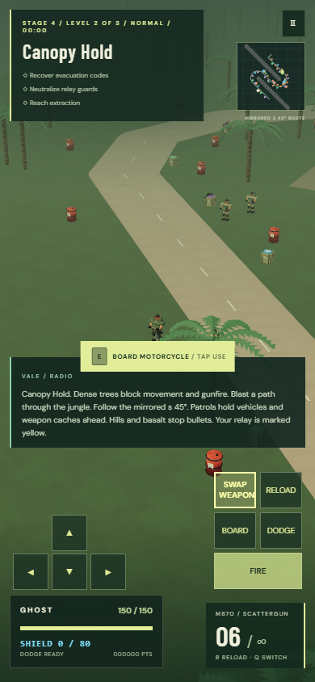

# Square expeditions and guarded equipment

Current route order and boss roster: [O loops and command bosses](LOOPS_COMMAND_BOSSES.md). Older layout notes below are retained as release history.

## Experience and level plan

The second and third levels use square expedition maps: 136 × 136 metres for S, mirrored S, L and U, and 196 × 196 metres for the 45-degree S variants. The first level keeps its northbound zigzag approach; Faultline Zero retains its southbound approach.

| Stage | Level 2 | Level 3 |
| --- | --- | --- |
| White Horizon | S sweep | L trail |
| Cinderfall | Mirrored S sweep | U trail |
| Dune Lifeline | S sweep, rotated 45° | L trail |
| Canopy Hold | Mirrored S sweep, rotated 45° | U trail |
| Citadel Dawn | S sweep | L trail |
| Faultline Zero | Mirrored S sweep | U trail |
| Mire Crossing | S sweep, rotated 45° | L trail |

S sweeps cross all four quadrants with two broad hairpins. The 45-degree variants rotate the full S or mirrored S about the map center, preserving its approximately 372-metre length. Ridge belts rotate with the road and extend to the expanded square boundary; scenery, hazards, vehicles, supplies, patrols and final encounter anchors are generated against the rotated route. Mirrored S sweeps reverse the turns. L trails run down one edge and across the bottom; U trails descend one side, round the bottom and climb the opposite side. All four occupy at least 100 metres in both axes. Roads keep a 7 metre surface and at least 7.6 metres of scenery clearance. Turns accommodate tanks.

The route is the source for spawn points, objective, final reinforcements, extraction, road rendering, vehicle bays and supply placement. The relay is at 78% of an expedition. Finale bosses deploy on the final arm, with space reserved for all four Crazy bosses. Saved campaign indices and upgrades remain valid.

## Permanent terrain

- S maps use two continuous ridge belts that separate the road arms and stop diagonal shortcuts. L and U maps have a broad rocky interior and an open outer corridor.
- Cinderfall and Faultline use dark basalt. Other biomes use low rocky hills, with pale rock in White Horizon.
- Landforms reuse the Blender rock model, fitted to their collision footprints and joined by a shallow bedrock base. They stop infantry, vehicles, bullets, lasers and blast line of sight.
- They have no destructible-health component: shooting, explosions and tank contact cannot remove them. Fuel drums and trees retain their existing destruction behavior.
- Permanent terrain stays visible in both Low and High graphics. Static geometry is batched; this change adds no asset downloads.
- The tactical map draws permanent ridges in gray. The briefing, route caption and field manual explain the layout and equipment encounters.

## Equipment encounters

The motorcycle appears around 13% of the route, the jeep around 40%, and the tank around 67%. Placement may shift a little to find a safe roadside bay. Parked vehicles leave the main road open, with tank-width connections to the road and safe boarding/exiting space. Scenery, traps and explosive drums are kept away from reserved bays.

Each vehicle has two nearby defenders in Normal/Easy. Sniper, rocket and laser caches also get two nearby defenders. These defenders replace twelve existing patrol positions; Hard and Crazy apply their existing two/four-times multipliers. Enemy totals and health settings are preserved. Other weapons, health and shields retain slightly randomized shoulder placement and accessible approaches.

Equipment remains physical and collectible. Killing guards does not delete or reset it, and there is no invisible lock preventing a risky capture. Blue vehicle markers and purple weapon markers help the player choose when to fight or advance.

## Implementation and review

1. Add explicit route shapes and square bounds, while retaining the seven-stage, three-level campaign and saved progress.
2. Generate biome scenery, permanent ridges and clear final encounter areas from the selected route.
3. Reserve vehicle bays before placing scenery and hazards. Distribute vehicles in upgrade order, and assign existing patrols to defend vehicles and selected caches.
4. Render permanent landforms using the existing Blender rock asset. Match model extents and collision and show terrain in the tactical map.
5. Check all 21 tank routes, final encounter formations, equipment access, seeded supplies, difficulty counts, weapon behavior, desktop and touch controls.
6. Build, review browser results and visual captures, commit and push through SSH, wait for GitHub Pages checks, and verify the published version.

## Validation

Unit checks exercise all 21 layouts and 630 supply seeds with parked vehicles included as obstacles. They require exact supply quotas, two defenders per selected reward, clear tank routes and bays, full map extents, and permanent terrain across direct shortcuts. Browser regressions cover all mission patrol counts, real boarding/exiting and weapon collection, and rifle/rocket/laser damage against permanent basalt.

- 22 Node checks passed, including exact 45-degree rotation and 630 seeded supply/guard layouts with parked vehicles.
- The seven affected expedition/route browser checks passed after adding diagonal maps, including all 21 Crazy patrol counts and vehicle/weapon collection on all three diagonal missions. GitHub Actions requires all 34 browser checks before publication.
- Production build passed. The existing 32-model download budget is unchanged.
- High desktop captures checked for all four shapes; 390 × 844 Low touch capture checked for visible controls, weapon switching and horizontal overflow. No browser page errors. These checks do not establish physical-device frame rates.
- GitHub Actions runs the full suite again before publishing to GitHub Pages.

## 45-degree route extension

- Dune Lifeline level 2 and Mire Crossing level 2 use S 45°. Canopy Hold level 2 uses mirrored S 45°. Other stages keep the original styles, giving seven route labels including the zigzag approach.
- Shared transforms preserve every segment length. Axis-aligned terrain collision is rebuilt and cleared against the diagonal road; the Blender landform models match those collision footprints.
- Expanded square bounds keep all route vertices at least ten metres inside the edge. New ridge tiles extend to the boundary so the rotated map does not acquire an open shortcut behind them.
- All 22 unit checks pass, including exact rotation/length assertions, all 21 tank routes, boss formations and 630 supply/guard seeds. The browser equipment test now includes all three diagonal missions. Deployment runs the full browser suite.

