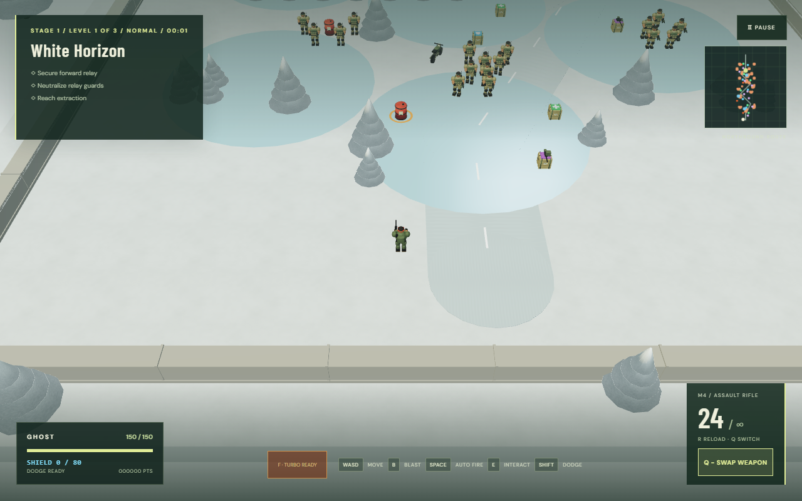
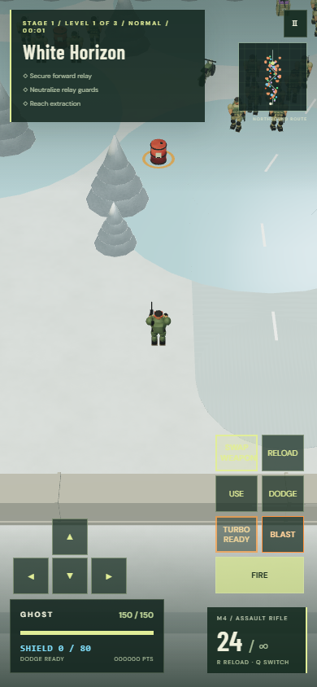
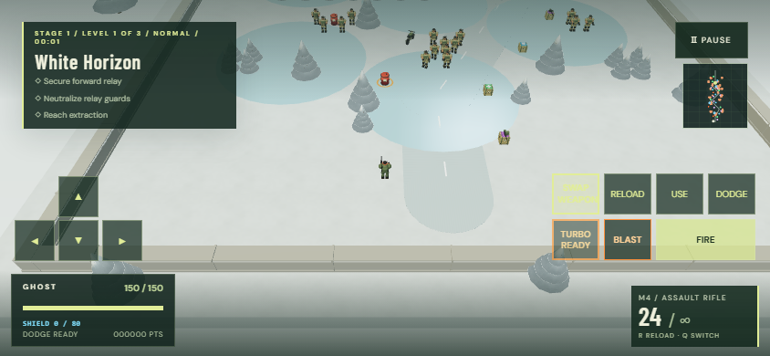

# Tactical combat review and implementation

## What the current build revealed

The complaint is consistent with the code. It does not establish a measured player retention or win-rate problem; that needs human play sessions. The previous release already used 30 rounds/s, a 120-round belt and 2.4-second reload. Halving the damage while doubling rate and belt preserved approximately 450 burst DPS and 281 sustained DPS. Repeating those values would not meaningfully weaken the M249.

Other findings:

- Normal bullets dealt full damage to infantry and tanks. A sustained-fire gun could answer both threats, reducing the reason to save rockets or change weapons.
- Space/mobile FIRE selected soldiers only. Fuel and explosive crates already caused real area damage, but players using aim assist could not deliberately select them.
- Unalerted infantry activated within 27 metres, while assisted aim reached 38 metres. Even after being shot, enemies beyond the activation radius could remain passive.
- Every second defeated non-boss dropped +30 health/vehicle repair. Increasing enemy density also increased free recovery, softening the intended difficulty.
- Explosions, falling bodies, fading blood, tank fragments and green tree dust already existed. Simply adding larger flashes would increase clutter. Feedback needed to explain armor resistance and reward a successful explosive crowd kill.

## Lessons from similar games

These are primary developer sources, consulted 13 September 2026. Their historical design explanations are useful comparisons, not claims about their latest balance patches.

- [SYNTHETIK — Flow Fire Games](https://www.synthetikgame.com/press-release): its top-down combat uses manual ejection, active reload, movement recoil, weapon heat and equipment choices. The relevant lesson is that sustained firing should carry a cost and equipment should enable tactical decisions. This pass adopts a meaningful reload window and weapon roles; manual ejection/jamming would add too much control complexity for the current mobile interface.
- [Helldivers 2 balance philosophy — Arrowhead](https://www.arrowheadgamestudios.com/2024/03/balancing-the-firepower-in-helldivers-2/): the developer explains specialized tools, armor penetration and preserving a weapon's intended feel while balancing it. Here the M249 keeps its dense stream, while small arms lose efficiency against tank armor.
- [Nex Machina — Housemarque](https://housemarque.com/news/nex-machina-from-housemarque-is-finally-here): the developer highlights enemy bullet patterns, alternate paths, special weapons and balancing survival with rescue objectives. My inference for Nightfall: enemy count alone cannot provide comparable variety; readable threats and optional explosive opportunities matter more than simply adding enemies or particles.

## Implemented values

Unupgraded nominal damage; actual hits still depend on accuracy, cover, range, armor and explosion falloff. DPS is an approximation at the fixed 60 Hz update, excluding the small empty-belt/reload transition overhead.

| Mechanic                                          | Before                   | Implemented                         | Intended role                                                                  |
| ------------------------------------------------- | ------------------------ | ----------------------------------- | ------------------------------------------------------------------------------ |
| M249 damage                                       | 15                       | 10                                  | Dense infantry fire with lower per-hit lethality                               |
| M249 rate/belt/reserve                            | 30/s, 120, 360           | 30/s, 120, 360                      | Four-second sustained burst, finite supply                                     |
| M249 reload                                       | 2.4 s                    | 2.8 s                               | Move, dodge or switch during the vulnerable window                             |
| M249 burst/sustained DPS                          | 450 / ~281               | 300 / ~176                          | ~37% lower sustained output                                                    |
| Rifle damage                                      | 43                       | 28                                  | Accurate, unlimited-reserve fallback; avoid creating the next dominant default |
| Ordinary rounds vs enemy tank armor               | 100%                     | 20% damage                          | Switch weapon or exploit a depot                                               |
| Sniper / flame / gas vs armor                     | 100%                     | 70% / 15% / 10%                     | Preserve sniper penetration; infantry tools struggle with heavy hulls          |
| Rockets, grenades, bow explosives, laser vs armor | 100%                     | 100%                                | Anti-armor and area-damage tools remain effective                              |
| Enemy tank main shell / light gun                 | 18 / 4                   | 36 / 8                              | Twice the offensive damage; unchanged 2.7 / 0.95 s cadence                     |
| Enemy tank main-gun warning                       | 0.6 s                    | 0.8 s, wider ring                   | Stronger threat with time to dodge                                             |
| Hit enemy activation                              | Still limited to 27/30 m | Respond within 42 m after being hit | Remove passive long-range targets                                              |
| Medical drops, Easy / Normal / Hard / Crazy       | 1/2 throughout           | 1/2, 1/6, 1/12, 1/24 enemy indices  | Keep Easy forgiving; avoid extra density producing extra recovery              |

For scale: a 65-HP infantry target takes seven M249 rounds or three rifle hits. A 230-HP tank takes 115 ordinary M249 hits through armor; a directly hitting missile plus its existing blast can destroy early tanks, while later tanks can require a second missile. Regular enemy tank HP stays 230–380 across stages, and playable tank armor stays 1,680. These are weapon-role differences, not a global increase in enemy health.

Armor reduction applies to regular enemy tanks and the armored laser-tank/missile-truck bosses. Other bosses keep their current resistances. It is applied once in the enemy damage path; direct collision/environmental damage without a weapon spec stays unchanged. Explosive store damage uses the existing explosive profile, so it bypasses small-arms resistance.

## Encounter and control changes

1. Reassign up to twelve existing infantry around three separated fuel/ammunition-explosive depots. Positions are within roughly three metres of a store, clear of cover and vehicles, and away from the starting point. Objective/cache defenders and enemy quotas are preserved. Runtime crowd collision still applies.
2. Keep the existing fuel/TNT blast: 5.5 m radius, up to 180 enemy damage, player/vehicle risk, distance falloff, wall protection and recursive chain explosions. Retain the visible red explosive crates and Blender-model fragments.
3. Add **hold B / hold BLAST**. It fires the current weapon at a store inside the camera view, preferring crowds. An orange ring marks the selection. No eligible store means no ammunition spent; releasing/canceling the hold stops the command. Mouse aiming and normal assisted FIRE remain available.
4. Check weapon range, solid cover, soldiers/vehicles obstructing a shot, and the connected explosive chain. Automatic selection excludes a two-metre safety margin beyond the blast reach around the player/vehicle. This is a selection aid, not invulnerability: moving toward a projectile's destination or manually firing at close stores can still cause damage.
5. Add a brief metallic armor cue and **ARMOR DEFLECTS · USE ROCKETS / LASER** message. Show a two-second **CHAIN BLAST · N HOSTILES DOWN** confirmation, protected from immediate replacement by the no-target hint. Throttle hit sounds and reuse the existing bounded impact pool; no per-frame particle population increase.
6. Mark explosive stores in orange on the tactical map. Keep the prior compact orange/yellow/red bullet palette for bright backgrounds. Landscape touch controls use two compact rows and smaller HUD panels to keep the minimap, health and ammunition unobstructed.

## Validation plan and results

- Unit checks: weapon roles and infantry hit counts, reduced M249 sustained budget, recovery normalization, safe/blocked/unsafe-chain target selection, all 21 layouts supporting clear depot guard positions, unchanged road access and difficulty population rules.
- Browser checks: real B and mobile BLAST input, simultaneous touch movement, cancellation/release, actual fuel/TNT crowd kills and ammunition consumption, no-target no-fire behavior, live armor damage, doubled tank attacks, warnings and long-range retaliation.
- Regression checks: actual 30 rounds/s and 120-round belts on foot/vehicles/Turbo; complete 2.8-second reload; existing hit, chain reaction, tree-crush, vehicle and corpse effects; Low/High dense-combat budgets.
- Production: TypeScript/Vite build, complete GitHub Actions suite, SSH push and GitHub Pages deployment, then desktop/mobile smoke against the exact deployed bundle.

Pre-push validation: **37 unit tests passed**, **21 distinct focused browser scenarios passed** across the tactical/environment/performance and hit-effects/Turbo runs, and TypeScript/production compilation passed. The 660-enemy fixture remained within both graphics budgets (Low 760 draw calls, High 907); local mean simulation updates were about 4.0 ms / 6.3 ms. These are fixture measurements, not device FPS. Desktop, portrait and landscape screenshots were inspected; touch buttons remain at least 44 pixels and do not overlap the landscape minimap or status panels. The full hosted suite remains the deployment gate.

Automated tests establish mechanics and detect regressions. Software-rendered browser timings cannot establish real mobile frame rates, and automated combat fixtures cannot prove that the game is fun. Human playtesting remains the next evidence needed for subjective pacing.

## Recommended next iteration after playtesting

Record a few Easy/Normal/Hard sessions: deaths and causes, time spent reloading, weapon usage, depot kills and mission completion time. Tune from those observations. In particular:

- If the game remains too easy, vary enemy attack roles and coordinated flanks before increasing HP or density again.
- If it becomes tedious, improve rocket availability near armored encounters and reduce repetitive encounters rather than restoring an all-purpose machine gun.
- Consider an optional timed reload bonus only after testing the current 2.8-second window; mobile already has many controls.
- Improve hit audio with distinct authored weapon/metal/body sounds in a later asset pass. Current effects are bounded procedural audio and particles, not evidence of AAA production quality.

## Visual review

Frozen local targeting previews, with the orange ring marking the selected explosive store:

