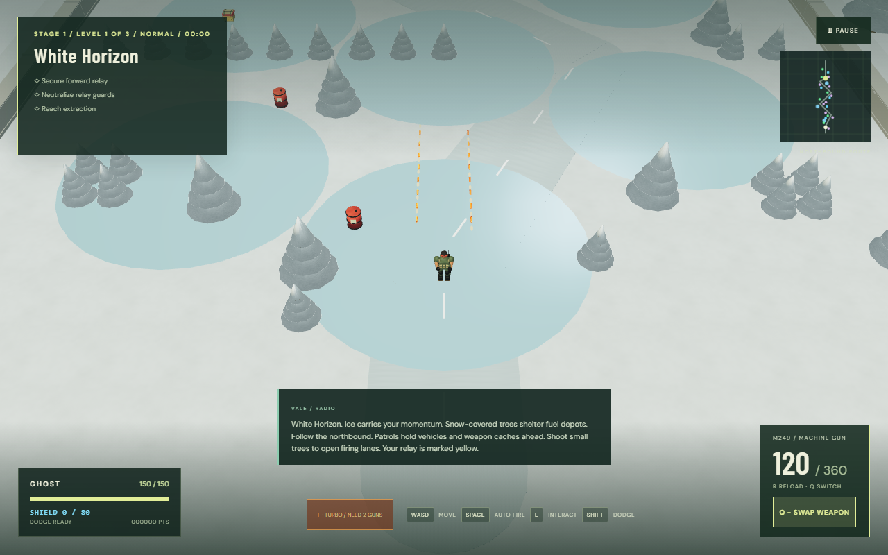
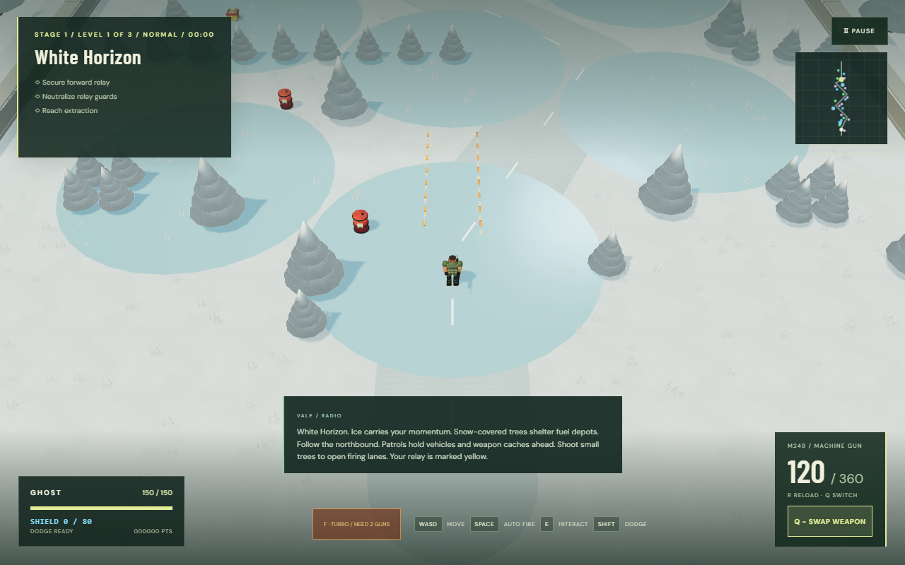

# Compact bullets and combat balance

Historical notes for release `78e10ec`. The M249/rifle and enemy armor values below were superseded by the [tactical combat pass](TACTICAL_COMBAT_REVIEW.md); compact bullet visuals and playable tank armor are retained.

## Implemented tuning

| Item                        | Previous                              | New                                               | Purpose                                                   |
| --------------------------- | ------------------------------------- | ------------------------------------------------- | --------------------------------------------------------- |
| Ordinary bullet envelope    | 0.95 m long, 0.20 m wide              | 0.475 m long, 0.10 m wide                         | Short, rounded rounds instead of long blocks              |
| Bullet palette              | Orange/gold friendly, magenta hostile | Orange bodies, yellow cores/tips, small red tails | Warm high contrast on snow; deeper orange incoming rounds |
| M249 damage                 | 30 per round                          | 15 per round                                      | Half damage per impact                                    |
| M249 cooldown               | 0.061 s                               | 0.0305 s                                          | Twice the actual 60 Hz fire rate: 15 to 30 rounds/s       |
| M249 belt / initial reserve | 60 / 180                              | 120 / 360                                         | Preserve firing duration and total carried damage         |
| M249 reload                 | 2.4 s                                 | 2.4 s                                             | Keep its sustained-fire role                              |
| Playable tank armor         | 420                                   | 1,680                                             | Four times the survivability                              |

## Balance rationale

At the game's fixed 60 Hz update, the M249 previously fired once every four ticks; it now fires once every two ticks. Approximate burst damage remains 450 per second. Both belts last about four seconds; including a 2.4-second reload gives about 281 damage/second over repeated belts, before accuracy, upgrades and reload boundary ticks. A complete initial load remains 7,200 potential damage. Two bullets replace each former bullet, so hit granularity changes slightly on small targets.

The rifle remains the accurate, economical default at 43 damage per shot. M249 spread and shorter projectile lifetime keep close-to-medium-range sustained fire distinct from the rifle and sniper. Existing power upgrades scale every weapon as before; Turbo and mounted personal weapons use these same specs and ammo banks.

Only playable tank armor is increased. Enemy tank and boss health and on-foot difficulty health are preserved, so the rest of the campaign does not become four times slower. The tank still moves at 5.3 m/s, starts with six non-reloadable cannon shells and requires exiting for objectives/extraction. Supplies still repair 30 armor, making its larger armor pool a finite buffer rather than a rapid full refill. Tree crushing still applies its 0.5 speed multiplier.

Visual changes affect tracer geometry only. Swept collision, projectile speed/range and impact/explosion effects are preserved. Friendly cores are yellow and enemy bodies more orange; both have yellow tips and a small red tail. No magenta is used for bullets in any biome. Special rockets, flames, gas and laser beams retain their separate visuals. Low and High use the same compact round with shared geometry and one draw call per bullet.

## Validation

Tests measure actual rounds and ammo consumption through the fixed-step game loop on foot, mounted and during Turbo, verify tank armor absorption, check the compact geometry/warm palette and exercise existing weapon impacts and vehicle loadouts. The dense-combat regression continues to cover both graphics profiles. Browser software rendering is not a physical-device frame-rate measurement.

Local validation: 33 unit tests passed; TypeScript/production build passed; 11 focused browser checks passed, covering firing cadence, reloads, tank loadouts, hits and 660-enemy combat. The Low/High visual review is recorded below. The two aligned bullet streams are a frozen comparison fixture, not a new firing pattern.

The vehicle emergency-exit regression now uses each vehicle's current armor: it verifies protection at one armor point and destruction/ejection at zero. This replaces the older fixed 999-damage assumption, which is no longer lethal to a 1,680-armor tank.
